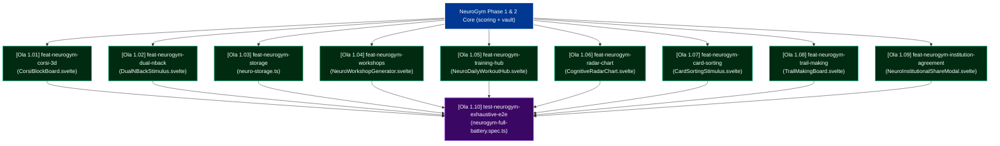

# GitCore Issues Dependency Tree — WorldExams NeuroGym Wave 1

> Canonical specification for parallel autonomous agent execution.
> Protocol: GitCore 3.8.0 / SWAL Monorepo.
> Location: `.gitcore/issues/neurogym-wave1/`

---

## 🌳 Dependency Graph (Max Depth: 2)

---

## 📋 File Islands Matrix (100% Disjoint)

| Issue ID | File Path | File Action | Parallel Execution Slot |
|---|---|---|---|
| `issue-01-corsi-3d.md` | `saberparatodos/src/components/neurogym/stimuli/CorsiBlockBoard.svelte` | `NEW` | Worker 1 |
| `issue-02-dual-nback.md` | `saberparatodos/src/components/neurogym/stimuli/DualNBackStimulus.svelte` | `NEW` | Worker 2 |
| `issue-03-indexeddb-vault.md` | `saberparatodos/src/lib/neurogym/neuro-storage.ts` | `NEW` | Worker 3 |
| `issue-04-workshop-generator.md` | `saberparatodos/src/components/neurogym/NeuroWorkshopGenerator.svelte` | `NEW` | Worker 4 |
| `issue-05-daily-training-hub.md` | `saberparatodos/src/components/neurogym/NeuroDailyWorkoutHub.svelte` | `NEW` | Worker 5 |
| `issue-06-radar-chart.md` | `saberparatodos/src/components/neurogym/CognitiveRadarChart.svelte` | `NEW` | Worker 6 |
| `issue-07-wisconsin-sorting.md` | `saberparatodos/src/components/neurogym/stimuli/CardSortingStimulus.svelte` | `NEW` | Worker 7 |
| `issue-08-trail-making.md` | `saberparatodos/src/components/neurogym/stimuli/TrailMakingBoard.svelte` | `NEW` | Worker 8 |
| `issue-09-institutional-export.md`| `saberparatodos/src/components/neurogym/NeuroInstitutionalShareModal.svelte`| `NEW` | Worker 9 |
| `issue-10-e2e-matrix.md` | `saberparatodos/tests/e2e/neurogym-full-battery.spec.ts` | `NEW` | Worker 10 (Post-merge L1) |
