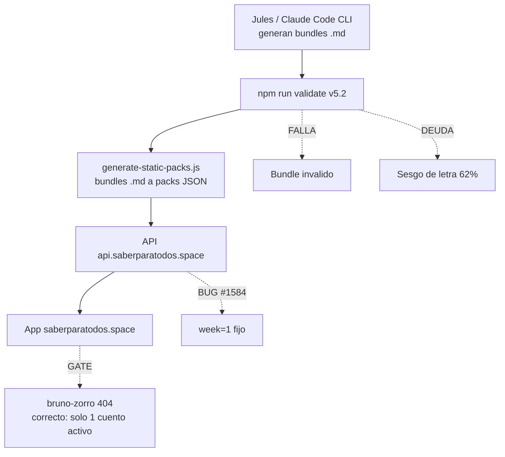

# WorldExams / SaberParaTodos — Estado, Agentes y Pendientes (2026-09-30)

> Informe compilado desde: repo `~/proyectosSWAL/apps/worldexams` (git + GitHub),
> 3 sesiones reales de Claude Code CLI (22 MB de transcripciones), kanban Hermes
> (3 tableros), `.gitcore/features.json`, auditoría `npm run audit:country-readiness`,
> smoke HTTP contra producción, y memorias de Xavier (`localhost:8006`).
> Todo dato numérico de abajo es un comando ejecutado, no una estimación.

---

## 1. Veredicto

**El proyecto está operativo y con producción sana, pero tiene dos deudas serias: un sesgo de letra en el 62% de los bundles ya publicados (calidad de examen, no de código) y ~11 commits + 6 archivos sin versionar.** El código y el despliegue están en verde; el contenido publicado es el riesgo.

| Dimensión | Estado | Evidencia |
|---|---|---|
| Producción (frontend + API) | Verde | 6/6 rutas HTTP 200, salvo gate intencional |
| Cobertura de contenido | Verde | 68.752 preguntas publicadas, 20 países |
| Pipeline de agentes | Verde | 30 issues cerrados desde 23sep, 103 PRs mergeados |
| Calidad del contenido | **ROJO** | 62% de bundles con sesgo >50% una letra |
| Higiene del repo | **ÁMBAR** | 11 commits sin push, 6 archivos sin commitear |

---

## 2. Diagrama del estado actual



---

## 3. Qué hicieron los agentes (evidencia real)

### 3.1 Claude Code CLI — 3 sesiones en el repo

Transcripciones en `~/.claude/projects/-home-belal-proyectosSWAL-apps-worldexams/`.

| Sesión | Tamaño | Objetivo | Resultado verificado |
|---|---|---|---|
| `2626d264` | 10 MB | Cuentos: motor 2.5D + portal Pequeños | 3 PRs mergeados (#1475, #1476, #1478) |
| `333573bf` | 5,7 MB | Diagnóstico rutas API + ola 16 | Terminó a mitad de la cola de integración |
| `bb2b7ec3` | 6,7 MB | Cierre de la ola 16 completa | 17 issues (#1480–#1496) cerrados, 25 merges |

**Sesión `2626d264` (Cuentos / Pequeños).** Detectó que el gate del catálogo
funcionaba mal y lo arregló. Terminó verificando en producción real, no en preview:
`/pequenos/` → 200 con la estantería 3D mostrando 1 solo libro (Tana, por diseño);
`/cuentos/tana-tucan-comparte/leer/` → 200; `/cuentos/bruno-zorro-paciencia/leer/` →
**404 real**, es decir el gate funciona en producción. En el camino de merge encontró y
corrigió dos problemas extra: conflictos de `package-lock.json` contra merges ajenos, y
una regeneración de lockfile mal hecha por él mismo. Cerró con un bug de CI real: el pipe
sin `pipefail` reportaba `deploy` exitoso aunque `wrangler deploy` fallara (#1478).

**Sesiones `333573bf` + `bb2b7ec3` (Ola 16, unlocked API y explicaciones).** Partieron
del síntoma reportado por el usuario: consola llena de `404 /api/packs/*` y
`[API] Returned 0 questions`. La causa raíz nunca fue el contenido — el frontend
descartaba los campos `explanation` y `options[].feedback`. Cerraron 17 issues en
cadena, incluyendo el cambio de arquitectura pedido (el cliente ahora pide solo las
preguntas del examen seleccionado, en vez de traerse todo), el hub ICFES persistente que
recuerda el tipo de examen elegido, el leaderboard ranked, y el smoke post-deploy que
ahora ejercita semanas distintas de la 1. Terminó con el smoke completo en verde contra
producción en el commit `84616f74`, y 5 fallos que aparecieron eran de la copia vieja del
script en la rama local, no de `main`.

**Método que usaron,[y vale la pena repetirlo:** las tres sesiones combinaron Bash
(900+ llamadas), lectura de memoria de Xavier antes de decidir, un `Agent` de apoyo
para exploration, y verificación final contra producción con `curl` — no Declararon nada
verde sin el smoke.

### 3.2 Jules (generación de contenido)

Es el agente de mayor volumen y sigue activo: los últimos PRs mergeados son suyos
(autoría `iberi22` vía cuenta de agente). Solo PR abierto del repo es `#1470` de
Dependabot. En los últimos días se cerraron **30 issues** (24–30 de septiembre) entre
olas 15 y 16, y se mergearon **103 PRs desde el 24 de septiembre**.

### 3.3 Kanban Hermes (3 tableros)

| Tablero | Tareas | Done | In progress | Ready | Todo | Archived |
|---|---|---|---|---|---|---|
| `worldexams` | 112 | 17 | 6 | 80 | 2 | 7 |
| `worldexams-brasil-rerun` | 22 | — | — | — | — | — |
| `worldexams-mx-g11-extra` | 22 | — | — | — | — | — |

39 tareas están asignadas a `worldexams-worker`. **80 tareas en `ready` son la cola de
contenido pendiente de despacho** (mayoritariamente bundles de grado 11 por país).

---

## 4. Cifras reales del proyecto

### 4.1 Cobertura por país (`npm run audit:country-readiness`, ejecutado 22:05 UTC)

**Total: 68.752 preguntas publicadas y validadas. 13 de 20 países superaron la meta de
2.000 preguntas.** Todos los países están en estado `published_validated`.

| País | Preguntas publ. | % meta 2000 | Brecha |
|---|---|---|---|
| CO Colombia | 22.204 | 1110% | 0 |
| SV El Salvador | 4.800 | 240% | 0 |
| PE Perú | 4.580 | 229% | 0 |
| CL Chile | 4.380 | 219% | 0 |
| MX México | 4.284 | 214% | 0 |
| CR Costa Rica | 4.160 | 208% | 0 |
| ES España | 3.800 | 190% | 0 |
| PR Puerto Rico | 3.600 | 180% | 0 |
| EC Ecuador | 3.400 | 170% | 0 |
| HN Honduras | 2.560 | 128% | 0 |
| UY Uruguay | 2.000 | 100% | 0 |
| PY Paraguay | 2.000 | 100% | 0 |
| BO Bolivia | 2.000 | 100% | 0 |
| AR Argentina | 1.544 | 77% | 456 |
| BR Brasil | 1.440 | 72% | 560 |
| PA / GT / DO / NI / GQ | 400 c/u | 20% | 1.600 c/u |

**Brecha total restante: 9.016 preguntas.** Concentrada: Argentina (456), Brasil (560) y
cinco países centroamericanos que solo tienen grado 11 (1.600 cada uno).

### 4.2 features.json (31 features)

26 en `passes: true`, 5 en `passes: false`:

| Feature pendiente | Bloquea | Por qué importa |
|---|---|---|
| `feat-private-grade-network` | Red privada de notas | Es la base del resto |
| `feat-anonymous-leaderboard` | Leaderboard anónimo | Depende de la anterior |
| `feat-governance-council` | Reglas por consejo | Sin nodos, no hay gobernanza |
| `feat-juego-elo-ligas` | Elo + ligas semanales | El área `/juego` ya responde 200 |
| `feat-olimpiadas-goat` | GOAT of Season | Depende del Elo anterior |

Las tres primeras están encadenadas: red privada → leaderboard → consejo. Es la
dependencia crítica del proyecto y las tres llevan `in_progress` en kanban sin dueño.

### 4.3 Smoke de producción (ejecutado hoy)

| Ruta | Código | Veredicto |
|---|---|---|
| `saberparatodos.space/` | 200 | OK |
| `saberparatodos.space/pequenos/` | 200 | OK, estantería 3D |
| `/cuentos/tana-tucan-comparte/leer/` | 200 | OK |
| `/cuentos/bruno-zorro-paciencia/leer/` | 404 | Correcto: gate del catálogo |
| `saberparatodos.space/juego/` | 200 | OK |
| `saberparatodos.space/ajustes/ia` | 200 | OK, IA on-device |

API (`api.saberparatodos.space`) — las 6 consultas devuelven 200 con preguntas reales:
CO G7 lengua (10), CO G11 mate (20), MX G11 mate (20), CO G10 lectura (12), CO G4
ciencias (8), y el pack estático de la semana 1 (10).

---

## 5. Hallazgos que requieren decisión

### 5.1 ROJO — Sesgo de letra en el 62% de los bundles publicados

Escaneé 200 bundles weekly de `origin/main` (2.789 disponibles) leyendo las respuestas
correctas `- [x] X)`:

```
bundles escaneados: 200   respuestas: 3060
distribución: A=1594  B=864  C=419  D=183
bundles con >50% de una sola letra: 124 (62%)
```

**La A gana en 3 de cada 4 respuestas, y la D casi no existe (6%).** Para un producto de
preparación de exámenes esto es un agujero de negocio: un estudiante que adivine "A"
acierta el 52% del tiempo sin leer nada, y los distractores no están haciendo su trabajo
pedagógico. Confirmado en mi memoria operativa: es **deuda preexistente**, no una
regresión reciente — el hook de pre-commit ya rechaza lotes con >50% de sesgo, pero solo
aplica a lo nuevo; los 2.789 bundles ya mergeados nunca pasaron por ese filtro.

El coste de arreglarlo es alto (reescribir la clave correcta de ~35.000 preguntas
publicadas y revalidar), pero el riesgo de dejarlo es que el producto se desacredite
ante un usuario que hace trampa.

### 5.2 ÁMBAR — El repo tiene trabajo sin commitear

```
Rama actual: feat/pequenos-portal-3d   (99 adelante / 11 detrás de origin/main)
Commits sin push: 11
Sin commitear: docs/DIAGNOSTICO_EXAMENES_2026-09-26.md
               saberparatodos/PEQUENOS_P{1,2,4}_REPORT.md
               saberparatodos/VERIFY_SUITE_REPORT.md
               questions_data/colombia/lectura-critica/grado-8/
               apps/worldexams-api/public/v1/packs/co-week-1-grade-8-...json
Stashes: 5 (el más reciente: bundles de Lectura Crítica G4 W27-W30)
```

El diagnóstico del 26-sep y los reportes de las fases P1/P2/P4 son entregables reales de
los agentes, perdidos en el working tree. Además `VERIFY_SUITE_REPORT.md` documenta que
**la suite E2E no pudo arrancar** (el dev server no levantó a tiempo, 0 tests
ejecutados) — ese reporte nunca se reemplazó con una ejecución verde.

### 5.3 ÁMBAR — Issues abiertos que importan

| # | Tema | Impacto |
|---|---|---|
| 1584 | `/v1/questions` solo sirve semana 1, ignora `?week=` | Bug abierto en prod |
| 1539 | `npm ci` falla en PRs de Dependabot (lock desalineado) | CI de terceros |
| 1270 | Pipeline de tandas cada 30 min | Ola 14, sigue abierto |
| 1453 | Bloquear inicio de sala sin contenido | Ola 15 |
| 1460/1461/1462 | Gate de superficies, runes, cache Vite | Ola 15 |

#1584 es el único bug de producción abierto, y choca de frente con el trabajo de la
ola 16: la sesión `bb2b7ec3`-creo que el proxy de packs ya devolvía 200 para cualquier
semana, pero el endpoint de preguntas sigue atado a la semana 1.

---

## 6. Fases siguientes (por valor)

| # | Fase | Valor | Riesgo |
|---|---|---|---|
| A | Commitear los 6 archivos perdidos + cerrar la rama | Alto | Bajo |
| B | Red privada de notas (desbloquea 2 features) | Máximo | Medio |
| C | Plan de remediación del sesgo de letra | Alto | Medio |
| D | Arreglar #1584 (`?week=` en /v1/questions) | Medio | Bajo |
| E | Cerrar brecha de AR/BR y los 5 países al 20% | Medio | Bajo |
| F | Reejecutar la suite E2E y reemplazar el reporte fallido | Medio | Bajo |

---

## 7. Sesión vs handoff

**SEGUIR EN SESIÓN** si quieres cerrar la Fase A: es un commit de archivos ya escritos,
la rama ya está mergeada, y despeja el working tree antes de que se pierda más trabajo.
Es la única fase con relación riesgo/beneficio favorable de forma inmediata.

El resto de fases (B a F) son trabajo de fondo que conviene Bordarlo en un handoff con
este informe como referencia, para no arrastrar 22 MB de transcripciones al contexto.

---

## 8. Cómo se verificó

```bash
# Estado y desviación
git -C ~/proyectosSWAL/apps/worldexams status --short
git -C ~/proyectosSWAL/apps/worldexams rev-list --left-right --count origin/main...HEAD
# -> 99  11

# PRs e issues
gh pr list --state open --json number,title      # -> 1 (#1470 dependabot)
gh issue list --state open --json number,title   # -> 9

# Cobertura (ejecutada 22:05 UTC)
cd ~/proyectosSWAL/apps/worldexams && npm run audit:country-readiness -- --json
# -> total_published_validated_questions: 68752, countries_ready: 13

# Producción
curl -s -o /dev/null -w "%{http_code}" https://saberparatodos.space/pequenos/   # 200
curl -s "https://api.saberparatodos.space/v1/questions?country=co&grade=11&subject=matematicas"

# Sesgo de letra (escaneo de 200 bundles de origin/main)
git ls-tree -r --name-only origin/main -- questions_data | grep '/weekly/' | wc -l
# -> 2789 ; A=1594 B=864 C=419 D=183 ; 62% con sesgo >50%

# Memoria de agentes
curl -s -X POST http://localhost:8006/v1/memories/search \
  -H "X-Xavier-Token: $XAVIER_TOKEN" -d '{"query":"worldexams","limit":5}'
```

**Nota de alcance:** las tres sesiones de Claude Code CLI son las que tienen transcripción
en `~/.claude/projects/` para este repo. Las de `atlas-saas`, `swal-vault` y `xavier`
correspondían a otros proyectos del ecosistema y quedan fuera de este informe.
