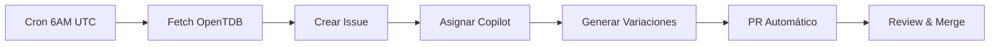

# 📚 Plan de Generación de Preguntas - World Exams

## 🎯 Objetivo
Generar un banco de preguntas diverso y de calidad para todos los países activos, utilizando fuentes públicas con atribución completa y automatización diaria.

---

## 🚀 Sistema de Automatización

### Ejecución Diaria
- **Workflow:** `.github/workflows/daily-question-generation.yml`
- **Horario:** 6:00 AM UTC (1:00 AM Colombia)
- **Rotación:** Un país y categoría diferente cada día de la semana

| Día | País | Categoría |
|-----|------|-----------|
| Lunes | 🇨🇴 CO | Matemáticas |
| Martes | 🇲🇽 MX | Ciencias |
| Miércoles | 🇧🇷 BR | Historia |
| Jueves | 🇺🇸 US | Geografía |
| Viernes | 🇨🇴 CO | Computación |
| Sábado | 🇲🇽 MX | Conocimiento General |
| Domingo | 🇧🇷 BR | Matemáticas |

### Flujo Automático


---

## 📊 Estado Actual de Preguntas

| País | Código | Preguntas Actuales | Meta Mínima | Prioridad | Issues Pendientes |
|------|--------|-------------------|-------------|-----------|-------------------|
| 🇨🇴 Colombia | CO | 97 | 500 | 🔴 Alta | 8 |
| 🇲🇽 México | MX | 10 | 500 | 🔴 Alta | 4 |
| 🇧🇷 Brasil | BR | 10 | 500 | 🔴 Alta | 3 |
| 🇺🇸 USA | US | 10 | 500 | 🔴 Alta | 3 |
| 🇦🇷 Argentina | AR | 3 | 200 | 🟡 Media | 0 |
| 🇨🇱 Chile | CL | 3 | 200 | 🟡 Media | 0 |
| 🇵🇪 Perú | PE | 3 | 200 | 🟡 Media | 0 |

---

## 🔍 Fuentes de Preguntas (Con Atribución)

> 📄 **Ver documentación completa:** [QUESTION_SOURCES.md](./QUESTION_SOURCES.md)

### Fuentes Principales

| Fuente | Licencia | Preguntas | Estado |
|--------|----------|-----------|--------|
| **OpenTDB** | CC BY-SA 4.0 | ~4,000 | ✅ Activa |
| **OpenTriviaQA** | CC BY-SA 4.0 | ~10,000 | 🔄 Pendiente |
| **Wikidata** | CC0 / CC BY-SA 3.0 | Ilimitadas | 🔄 Pendiente |

### 1. Open Trivia Database (OpenTDB) - ACTIVA
- **URL:** https://opentdb.com
- **Licencia:** CC BY-SA 4.0 ✅
- **API:** https://opentdb.com/api.php
- **Límite:** 50 preguntas por request, sin autenticación

### 2. OpenTriviaQA (GitHub) - PENDIENTE
- **URL:** https://github.com/uberspot/OpenTriviaQA
- **Licencia:** CC BY-SA 4.0 ✅
- **Formato:** Archivos de texto plano
- **Estado:** Pendiente de integrar

### 3. Wikidata - PENDIENTE
- **URL:** https://www.wikidata.org
- **Licencia:** CC0 / CC BY-SA 3.0 ✅
- **Uso:** Datos factuales para generación procedural
- **Estado:** Pendiente de implementar queries SPARQL

---

## 📅 Plan de Ejecución Automatizado

### Ejecución Diaria Automática
El workflow `daily-question-generation.yml` se ejecuta automáticamente:

```bash
# Ejecutar manualmente con configuración personalizada
gh workflow run daily-question-generation.yml \
  --repo iberi22/worldexams \
  -f countries=CO,MX,BR,US \
  -f categories=mathematics,science \
  -f questions_per_batch=5
```

### Issues Generados Automáticamente
Cada día se crea un issue con:
1. ✅ Preguntas fuente de OpenTDB
2. ✅ Instrucciones detalladas para Copilot
3. ✅ Atribución completa de la fuente
4. ✅ Asignación automática a Copilot Agent

### Copilot Coding Agent
Para asignar Copilot manualmente a un issue existente:
```bash
# Usando GitHub CLI (requiere permisos)
gh api repos/iberi22/worldexams/issues/[ISSUE_NUMBER]/assignees \
  -f assignees[]="copilot"
```

---

## 📊 Issues Actuales (19 pendientes)

| # | País | Categoría | Preguntas | Estado |
|---|------|-----------|-----------|--------|
| 19 | 🇺🇸 US | History | 30 | ⏳ Pendiente |
| 18 | 🇺🇸 US | Computers | 30 | ⏳ Pendiente |
| 17 | 🇺🇸 US | Mathematics | 30 | ⏳ Pendiente |
| 16 | 🇧🇷 BR | Geography | 30 | ⏳ Pendiente |
| 15 | 🇧🇷 BR | History | 30 | ⏳ Pendiente |
| 14 | 🇧🇷 BR | Science | 30 | ⏳ Pendiente |
| 13 | 🇲🇽 MX | General Knowledge | 30 | ⏳ Pendiente |
| 12 | 🇨🇴 CO | Computers | 30 | ⏳ Pendiente |
| 11 | 🇲🇽 MX | History | 30 | ⏳ Pendiente |
| 10 | 🇲🇽 MX | Mathematics | 30 | ⏳ Pendiente |
| 9 | 🇨🇴 CO | History | 30 | ⏳ Pendiente |
| 8 | 🇨🇴 CO | Geography | 30 | ⏳ Pendiente |
| 7 | 🇨🇴 CO | Computers | 30 | ⏳ Pendiente |
| 6 | 🇨🇴 CO | Mathematics | 30 | ⏳ Pendiente |
| 5 | 🇨🇴 CO | Geography | 30 | ⏳ Pendiente |
| 4 | 🇨🇴 CO | History | 30 | ⏳ Pendiente |
| 3 | 🇨🇴 CO | Mathematics | 30 | ⏳ Pendiente |
| 2 | 🇲🇽 MX | Mathematics | 12 | ⏳ Pendiente |
| 1 | 🇨🇴 CO | Science | 12 | ⏳ Pendiente |

**Total potencial:** ~534 preguntas (89 fuentes × 6 variaciones)

---

## 🔄 Comandos de Ejecución

### Ejecutar Generación Diaria (Manual)

```bash
# Ejecutar con valores por defecto (rotación diaria)
gh workflow run daily-question-generation.yml --repo iberi22/worldexams

# Ejecutar con configuración personalizada
gh workflow run daily-question-generation.yml --repo iberi22/worldexams \
  -f countries=CO,MX \
  -f categories=mathematics,science \
  -f questions_per_batch=10
```

### Ejecutar Research Workflow (Legacy)

```bash
# Colombia - Matemáticas
gh workflow run research-questions.yml --repo iberi22/worldexams \
  -f country=CO -f category=mathematics -f num_questions=10 -f language=es
```

---

## 📝 Formato de Atribución en Preguntas

Cada pregunta generada DEBE incluir:

```yaml
---
id: "CO-MAT-11-algebra-001"
grado: 11
asignatura: "Matemáticas"
tema: "Álgebra"
dificultad: 3
estado: published
creador: "Copilot"

# ATRIBUCIÓN OBLIGATORIA
source: "OpenTDB"
source_url: "https://opentdb.com"
source_license: "CC BY-SA 4.0"
inspired_by: "What is the square root of 144?"
variation: 1
generation_date: "2024-12-04"
---
```

---

## 🤖 Script de Ejecución Masiva

Ejecutar el siguiente script para generar todas las preguntas del plan:

```powershell
# Plan de ejecución masiva
$countries = @(
    @{code="CO"; lang="es"; categories=@("mathematics","science","history","geography")},
    @{code="MX"; lang="es"; categories=@("mathematics","science","history","general_knowledge")},
    @{code="BR"; lang="pt"; categories=@("mathematics","science","history","geography")},
    @{code="US"; lang="en"; categories=@("mathematics","science","history","computers")}
)

foreach ($country in $countries) {
    foreach ($category in $country.categories) {
        Write-Host "Generating: $($country.code) - $category"
        gh workflow run research-questions.yml --repo iberi22/worldexams `
            -f country=$($country.code) `
            -f category=$category `
            -f num_questions=10 `
            -f language=$($country.lang)
        Start-Sleep -Seconds 5  # Evitar rate limiting
    }
}
```

---

## ✅ Checklist de Calidad

Para cada lote de preguntas generadas:

- [ ] Verificar atribución de fuente completa
- [ ] Validar traducción al idioma correcto
- [ ] Confirmar formato de ID correcto
- [ ] Revisar que los distractores sean plausibles
- [ ] Verificar explicación clara
- [ ] Confirmar nivel de dificultad apropiado

---

## 📈 Métricas de Progreso

| Semana | Preguntas Generadas | Issues Creados | PRs Merged |
|--------|--------------------:|---------------:|-----------:|
| 1 | 0 | 2 | 0 |
| 2 | - | - | - |
| 3 | - | - | - |
| 4 | - | - | - |

---

## 🔗 Referencias

- [OpenTDB API Docs](https://opentdb.com/api_config.php)
- [Creative Commons Licenses](https://creativecommons.org/licenses/)
- [GitHub Actions Workflow Syntax](https://docs.github.com/en/actions/reference/workflow-syntax-for-github-actions)

---

*Última actualización: 4 de diciembre de 2024*
