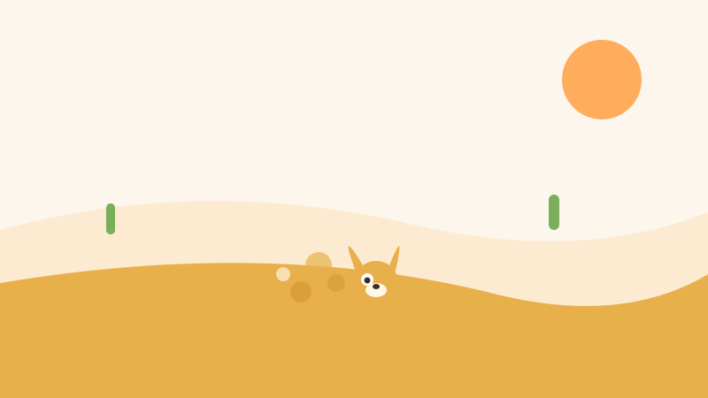
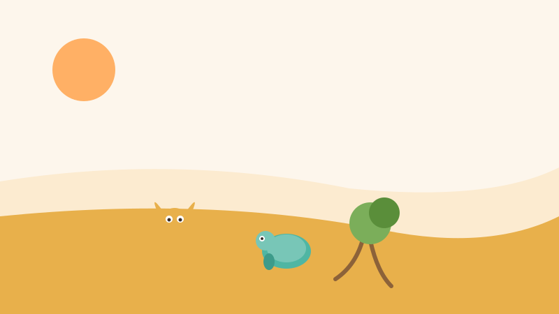
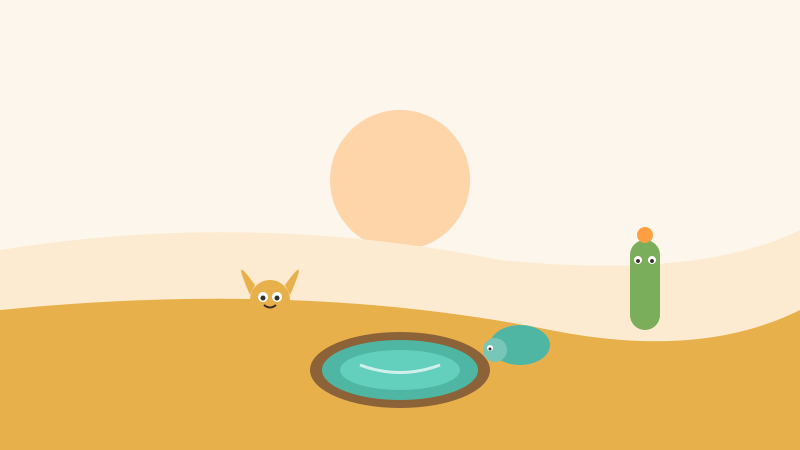

<!-- © 2026 SaberParaTodos / WorldExams. Todos los derechos reservados. Lectura gratuita, prohibida su reproducción. -->
---
slug: "bruno-zorro-paciencia"
titulo: "Bruno el zorro del desierto y el pozo de la paciencia"
edad: "3-4"
idioma: "es-neutro"
eje: "animales"
habitat: "desierto"
valor: "paciencia"
personajes: ["bruno", "nuna", "espino"]
paginas: 8
license: "PROPRIETARY-FREE-READ"
version: 1
---

## Pagina 1

En el cálido desierto vivía Bruno, un pequeño zorro de orejas muy grandes. Tenía mucha sed y quería encontrar agua de inmediato. Por eso corría de un lado a otro y cavaba rápido en cualquier parte del suelo. Hacía volar la arena con sus patas, pero no aparecía ni una sola gota.

## Pagina 2

Bruno miró a su alrededor y vio muchos hoyos en la tierra. Todos estaban secos y vacíos. El pequeño zorro se sentó sobre la arena caliente y suspiró con tristeza. Tenía las patas cansadas de cavar apurado. Se sentía muy frustrado porque su prisa no lo ayudaba a calmar la sed.

## Pagina 3

Cerca de allí caminaba despacio Nuna la tortuga. Al ver a Bruno triste, se acercó con pasos suaves.
—Para buscar agua no hay que correr —dijo Nuna—. Hay que mirar con cuidado y cavar muy despacio cerca de las raíces de los arbustos, porque allí se guarda la frescura de la tierra.

## Pagina 4

En ese momento habló el Cactus Abuelo Espino con voz muy tranquila.
—El sol del día seca todo por arriba —explicó el sabio cactus—. Pero cuando llega la noche, el agua fresca baja por la tierra suavemente. Para encontrarla debes saber esperar y respirar con calma.

## Pagina 5

Bruno escuchó con atención a sus amigos. Decidió sentarse bajo el cielo estrellado de la noche desértica. Respiró hondo una, dos y tres veces. Dejó de correr y esperó con calma mientras el aire fresco de la noche enfriaba las dunas. Aprendió que la paciencia ayuda a pensar mejor.

## Pagina 6

Cuando la noche estuvo bien oscura, Bruno caminó despacio hacia el arbusto. Cavó suavemente junto a las raíces, tal como le enseñó Nuna. De pronto sintió la tierra húmeda en sus patitas. Siguió cavando con paciencia y brotó un pozo de agua limpia y muy fresca.

## Pagina 7

Bruno dio un brinco de alegría, pero no bebió él solo. Llamó de inmediato a Nuna la tortuga y al Abuelo Espino. Juntos tomaron agua fresca en la orilla del pozo. Bruno se sintió feliz de haber aprendido a esperar y de tener amigos con quienes compartir su logro.

## Pagina 8

Desde esa noche, el pozo se convirtió en un hermoso lugar de descanso para todos los animales del desierto. Bruno comprendió que cuando hacemos las cosas con paciencia y dedicación, los mejores resultados siempre llegan a su tiempo. Lo bueno tarda un poco, pero llena el corazón de alegría.

## Quiz
### Pregunta 1
¿Por qué Bruno no encontraba agua al principio?
- [x] A) Porque cavaba rápido y en cualquier lado sin paciencia
  <!-- feedback: ¡Así es! Al cavar apurado solo hacía hoyos secos. -->
- [ ] B) Porque no tenía patas para cavar en la arena
  <!-- feedback: Bruno sí tenía patas, pero cavaba con mucha prisa. -->
- [ ] C) Porque no había agua en todo el desierto
  <!-- feedback: Sí había agua subterránea, pero debía buscar con calma. -->

### Pregunta 2
¿Quiénes le enseñaron a Bruno cómo y cuándo buscar agua?
- [x] A) Nuna la tortuga y el Abuelo Espino
  <!-- feedback: ¡Correcto! Nuna le enseñó a cavar junto a las raíces y Espino a esperar la noche. -->
- [ ] B) Un pájaro volador que pasó por el cielo
  <!-- feedback: No fue un pájaro, sus consejeros fueron la tortuga y el cactus. -->
- [ ] C) Nadie, él lo descubrió solo sin ayuda
  <!-- feedback: Bruno escuchó los sabios consejos de Nuna y el Abuelo Espino. -->

### Pregunta 3
¿Qué hizo Bruno cuando encontró el pozo de agua?
- [x] A) Lo compartió alegremente con Nuna y Espino
  <!-- feedback: ¡Muy bien! Celebró y compartió el agua fresca con todos. -->
- [ ] B) Tapó el pozo para que nadie lo viera
  <!-- feedback: Al contrario, Bruno llamó a sus amigos para compartir. -->
- [ ] C) Se fue corriendo a otro desierto lejano
  <!-- feedback: No se fue, se quedó disfrutando del pozo con sus amigos. -->

### Explicacion
Bruno quería resolver todo de prisa y solo conseguía cansarse. Al escuchar los consejos y tener paciencia, logró encontrar el agua y crear un lugar hermoso para todos. Pregunte a su niña o niño: ¿en qué momento te ayuda a ti tener paciencia?
