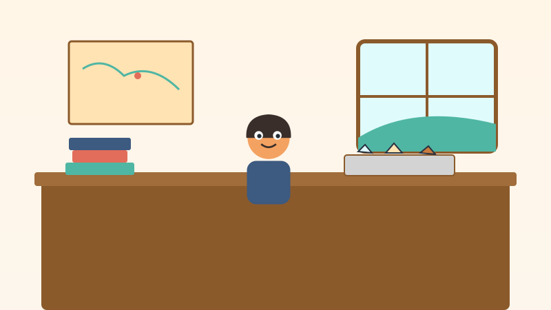

<!-- © 2026 SaberParaTodos / WorldExams. Todos los derechos reservados. Lectura gratuita, prohibida su reproducción. -->
---
slug: "don-emilio-mina"
titulo: "Don Emilio y la mina que cuida el cerro"
edad: "5-6"
idioma: "es-neutro"
eje: "oficios"
habitat: "mina"
valor: "trabajo"
personajes: ["emilio", "suli", "carbonilla"]
paginas: 8
license: "PROPRIETARY-FREE-READ"
version: 1
---

## Pagina 1

En la falda del cerro verde vivía Emilio. Cuando era pequeño, le gustaba
caminar por los senderos y juntar piedras brillantes que relucían con
el sol. Las guardaba en su bolsillo con gran curiosidad. Emilio no lo
sabía entonces, pero de aquellas piedras salían los metales con los que
construimos bicicletas, puentes y teléfonos.
> Para conversar en familia: Observen las piedras en el camino y conversen sobre los metales que usamos diariamente.
**Palabras nuevas:** cerro, senderos, piedras

## Pagina 2

Cuando creció, Emilio decidió estudiar con entusiasmo todo sobre la
tierra y las rocas. Aprendió cómo buscar los minerales de forma limpia sin
lastimar la naturaleza. Trabajó con dedicación hasta convertirse en
minero. Con sus manos y su inteligencia, Emilio entendió que cuidar la
tierra es tan importante como extraer lo que necesitamos.
> Para conversar en familia: Conversen sobre el valor de estudiar con entusiasmo para cuidar la naturaleza del cerro.
**Palabras nuevas:** rocas, minerales, minero

## Pagina 3

La mina del año 2026 era un lugar moderno y seguro. Don Emilio usaba un
casco amarillo con una luz potente en el frente. En el túnel flotaba un
dron pequeñito que revisaba el aire y las paredes. Junto a él, la
ingeniera Suli examinaba pantallas digitales con sensores que indicaban
que todo estaba en orden.
> Para conversar en familia: Señalen la luz potente del casco de Don Emilio e imaginen volar un dron pequeñito.
**Palabras nuevas:** casco, túnel, dron

## Pagina 4

En la mina de Don Emilio había una regla de oro que todos respetaban con
alegría: por cada hueco, un árbol nuevo. Cada vez que extraían
minerales, Don Emilio y la ingeniera Suli sembraban un arbolito en la
ladera. La perrita Carbonilla corría feliz alrededor mientras las raíces
jóvenes abrazaban la tierra firme.
> Para conversar en familia: Imaginen sembrar un arbolito en la ladera del cerro y cuidar su crecimiento juntos.
**Palabras nuevas:** regla, ladera, perrita

## Pagina 5

Una mañana brillante, un sensor de seguridad emitió un sonido claro y
suave: ¡bip, bip! No había ningún peligro, sino una prueba de rutina para
cuidar al equipo. Al oír la señal, Don Emilio, la ingeniera Suli y todos los
trabajadores caminaron en fila de manera muy ordenada y tranquila hacia la
salida.
> Para conversar en familia: Practiquen caminar en una fila ordenada y tranquila como hicieron los trabajadores.
**Palabras nuevas:** sensor, señal, fila

## Pagina 6

Afuera del túnel, bajo el sol brillante, la perrita Carbonilla se puso su
chaleco de rescate. Con su olfato fino y su paso alegre, caminó despacio
para revisar que el túnel estuviera completamente limpio. Al terminar,
dio un ladrido contento para confirmar que todo el equipo estaba afuera
sano y salvo.
> Para conversar en familia: Den un pequeño ladrido alegre imitando a la perrita Carbonilla cuando confirma la seguridad.
**Palabras nuevas:** chaleco, olfato, ladrido

## Pagina 7

Saber que todos trabajaban seguros fue motivo de alegría. Esa tarde
celebraron una gran fiesta en el cerro porque sembraron el árbol número
mil. Pusieron banderines de colores y globos en las ramas altas. Don Emilio,
Suli y Carbonilla aplaudieron contentos al ver la colina más verde y
hermosa que nunca.
> Para conversar en familia: Cuenten los colores de los banderines festivos y celebren el trabajo en equipo.
**Palabras nuevas:** fiesta, banderines, colina

## Pagina 8

Al caer la tarde, Don Emilio contempló el cerro florecido mientras el
sol doraba los árboles jóvenes. Observó su casco, abrazó a la perrita
Carbonilla y sonrió con orgullo. Aprendió que la minería responsable ayuda
a las familias y protege el medio ambiente. Porque el trabajo bueno cuida
a la gente y a la tierra.
> Para conversar en familia: Tomen de las manos a su niña o niño y recuerden cuidar con amor nuestra tierra.
**Palabras nuevas:** sol, medio, ambiente

## Quiz
### Pregunta 1
¿Qué estudiaba Emilio de niño sin saberlo?
- [x] A) Las piedras brillantes y los metales
  <!-- feedback: ¡Excelente! De las piedras brillantes salen los metales para bicicletas y teléfonos. -->
- [ ] B) Los peces del río
  <!-- feedback: No eran peces, Emilio juntaba piedras en el cerro. -->
- [ ] C) Las nubes del cielo
  <!-- feedback: Las nubes son hermosas, pero Emilio observaba las rocas de la tierra. -->

### Pregunta 2
¿Qué revisan los drones en la mina moderna?
- [x] A) La mina, para asegurar que el aire y el entorno estén firmes
  <!-- feedback: ¡Muy bien! Los drones ayudan a verificar la seguridad de todo el equipo. -->
- [ ] B) Dónde guardar juguetes
  <!-- feedback: Los drones de la mina ayudan en la seguridad del trabajo. -->
- [ ] C) Cómo forman nidos las aves
  <!-- feedback: Las aves forman sus nidos en las ramas, los drones revisan la mina. -->

### Pregunta 3
¿Cuál es la regla de oro de la mina de Don Emilio?
- [x] A) Por cada hueco, un árbol nuevo
  <!-- feedback: ¡Correcto! Reforestar cuida el cerro y mantiene la tierra firme. -->
- [ ] B) Esconder todas las rocas
  <!-- feedback: No, la regla enseña a sembrar árboles para cuidar la naturaleza. -->
- [ ] C) Trabajar sin casco ni luz
  <!-- feedback: La seguridad es lo primero, siempre usan casco con luz. -->

### Explicacion
Don Emilio nos enseña que el trabajo con tecnología y responsabilidad cuida
a las personas y fortalece la naturaleza. Reforestar y usar sensores nos
permite obtener los materiales que necesitamos sin dañar nuestra tierra.
Pregunta a tu niño: ¿qué oficio te gustaría aprender cuando seas grande?
