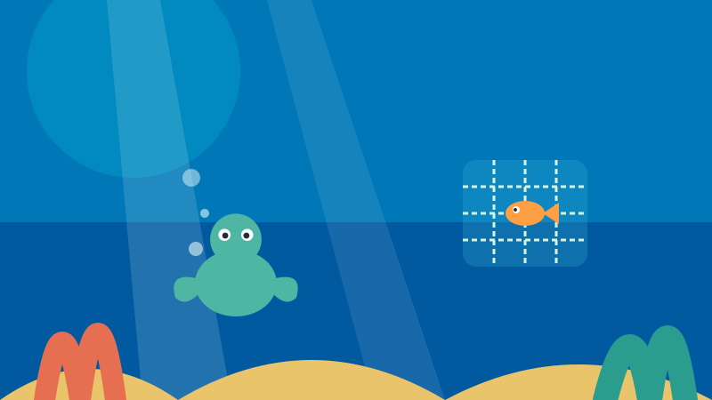
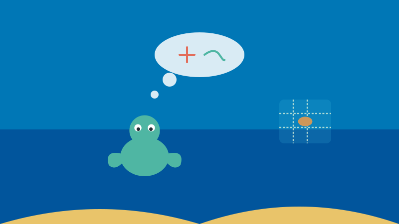
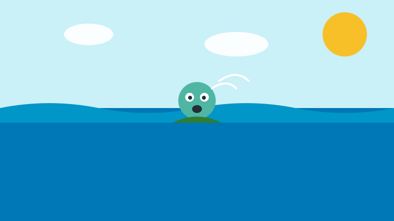
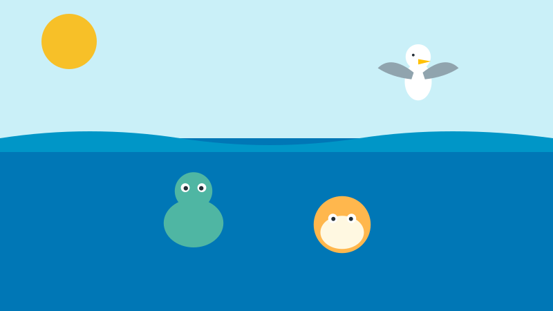
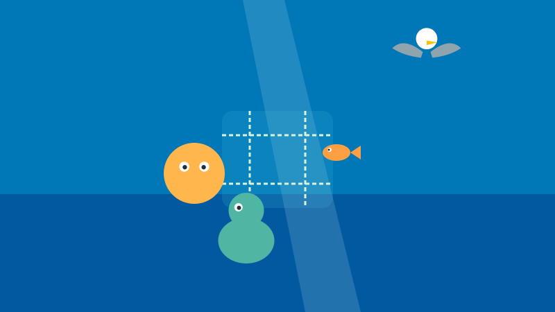
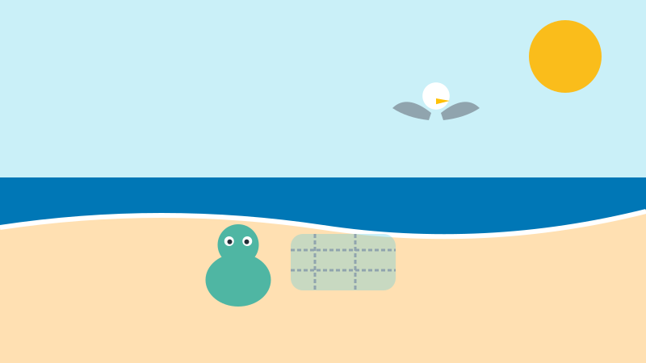
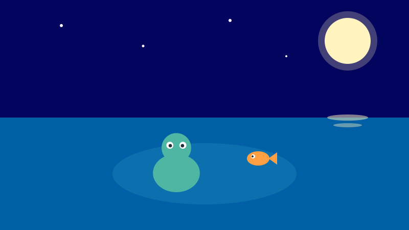
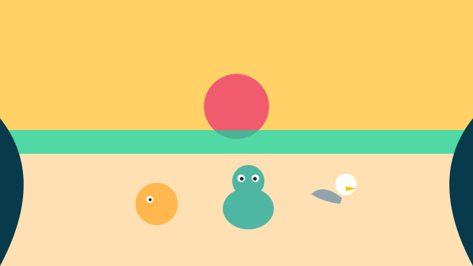

<!-- © 2026 SaberParaTodos / WorldExams. Todos los derechos reservados. Lectura gratuita, prohibida su reproducción. -->
---
slug: "lila-tortuga-red"
titulo: "Lila la tortuga y el dilema de la red"
edad: "5-6"
idioma: "es-neutro"
eje: "etica"
habitat: "oceano"
valor: "altruismo"
personajes: ["lila", "tom", "vela"]
paginas: 8
license: "PROPRIETARY-FREE-READ"
version: 1
---

## Pagina 1

Lila era una tortuga verde marina que nadaba feliz entre corales brillantes. Un día vio una gran red abandonada que flotaba en el agua. Adentro había un pececito atrapado que no podía salir. Lila nadó un poco más cerca para observar bien la red.

## Pagina 2

La tortuga sintió una gran duda en su corazón. Si nadaba hacia la red para ayudar, sus propias aletas podían quedar enredadas. Si se iba nadando a un lugar seguro, el pececito se quedaba solo y triste. Lila no sabía qué decisión tomar en ese momento.

## Pagina 3

Lila decidió sacar la cabeza sobre el agua azul. Respiró hondo y dijo en voz alta que tenía miedo de quedar atrapada. Decir lo que sentía la hizo sentir un poco más tranquila. Sabía que no debía resolver este peligro ella sola sin ayuda.

## Pagina 4

Lila llamó a sus amigos para pedir auxilio. Llegó Tom, un pez globo fuerte que podía empujar con cuidado, y Vela, una gaviota de vista rápida. Juntos organizaron un plan seguro: Tom empujaría la red, Vela vigilaría desde el aire y Lila guiaría al pececito.

## Pagina 5

Tom infló su cuerpo y empujó un lado del nudo sin tocar las cuerdas. Vela avisó desde arriba por dónde abrir paso. Con mucha paciencia, Lila movió un pedazo de red con la punta del caparazón. El pececito nadó rápido hacia afuera y quedó libre.

## Pagina 6

Para que ningún otro animal sufriera peligro, los tres amigos tomaron la red con cuidado. La arrastraron suavemente fuera del mar hasta dejarla bien lejos sobre la arena seca de la playa. Ahora el agua del arrecife estaba limpia y segura otra vez.

## Pagina 7

Desde ese momento, cada vez que salía la luna llena en el cielo, el pececito volvía al arrecife a visitar a sus tres salvadores. Nadaban juntos trazando círculos plateados en el agua. Lila sentía una inmensa alegría por haber ayudado a su nuevo amigo.

## Pagina 8

Lila aprendió una valiosa lección que jamás olvidaría para siempre. Cuando sientes miedo, es muy bueno decirlo en voz alta sin vergüenza. Cuando algo es difícil o peligroso, se pide ayuda a los demás. El bien más grande siempre se logra entre varios amigos.

## Quiz
### Pregunta 1
¿Cuál era el dilema de Lila al ver la red?
- [x] A) Ayudar con riesgo de enredarse o irse y dejar solo al pez
  <!-- feedback: ¡Correcto! Tenía miedo de quedar atrapada, pero no quería abandonar al pececito. -->
- [ ] B) Comerse la red o dejarla flotar
  <!-- feedback: Las redes no son comida, son peligrosas para los animales marinos. -->
- [ ] C) Buscar tesoros ocultos en la arena
  <!-- feedback: Lila no buscaba tesoros, quería saber qué acción realizar con la red abandonada. -->

### Pregunta 2
¿Qué hizo Lila cuando sintió miedo?
- [x] A) Lo dijo en voz alta y pidió ayuda a sus amigos
  <!-- feedback: ¡Muy bien! Hablar del miedo y pedir ayuda es valiente y seguro. -->
- [ ] B) Se escondió dentro de su caparazón y descansó
  <!-- feedback: Lila no se durmió; decidió expresar lo que sentía para buscar una solución. -->
- [ ] C) Salió corriendo del mar para nunca volver
  <!-- feedback: Lila ama el océano; solo buscó ayuda para resolver el problema juntos. -->

### Pregunta 3
¿Por qué no intentó liberar al pececito ella sola?
- [x] A) Porque entre varios es más seguro y cada amigo ayudó con una tarea
  <!-- feedback: ¡Excelente! Tom empujó, Vela vigiló y Lila guió al pececito. -->
- [ ] B) Porque no sabía nadar bien en el agua
  <!-- feedback: Lila nada excelente, pero trabajar en equipo evita que alguien corra peligro. -->
- [ ] C) Porque el pececito no quería salir de la red
  <!-- feedback: El pececito quería ser libre y estaba muy contento al salir. -->

### Explicacion
Lila enfrentó un problema peligroso y sintió miedo, lo cual es totalmente normal. En lugar de arriesgarse sola o ignorar al pececito, expresó lo que sentía y pidió ayuda a sus amigos. Trabajar juntos nos permite ayudar a los demás cuidando nuestra propia seguridad.
