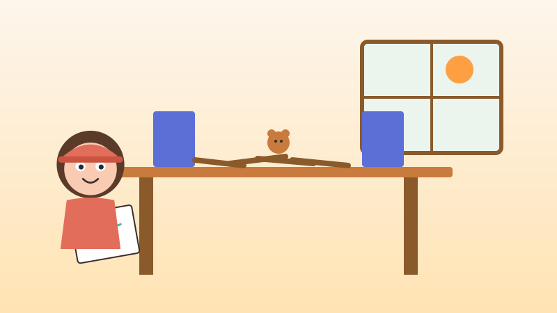
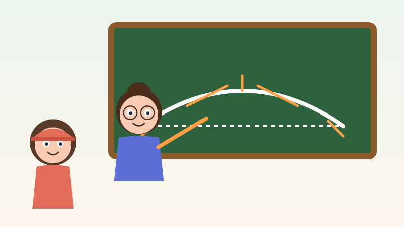
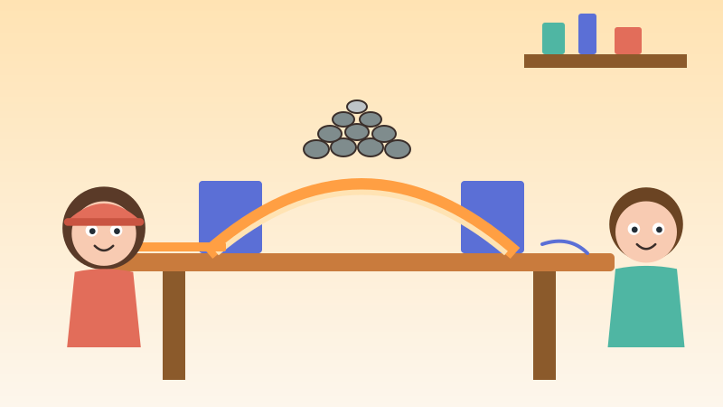
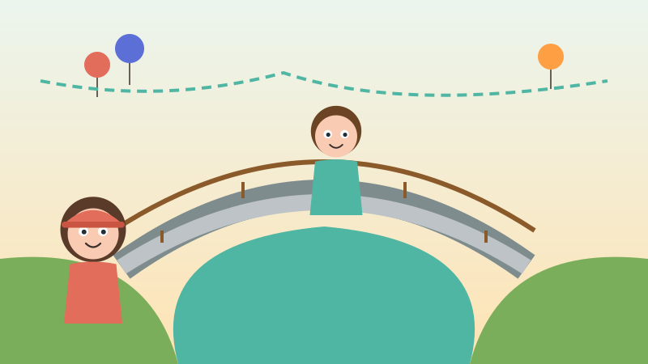
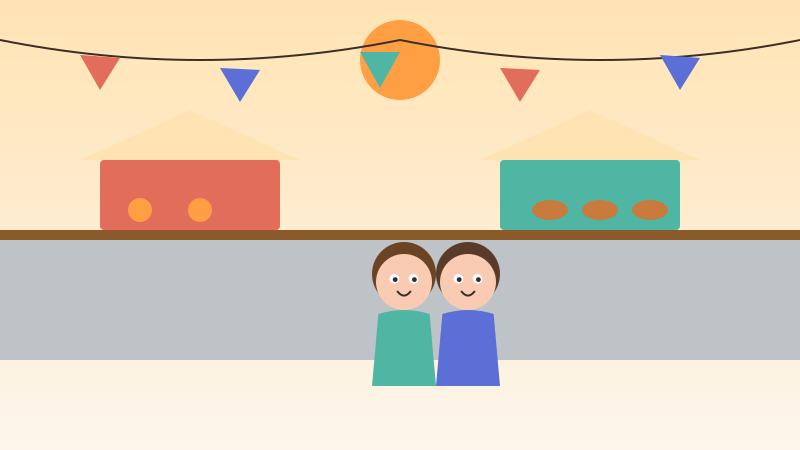
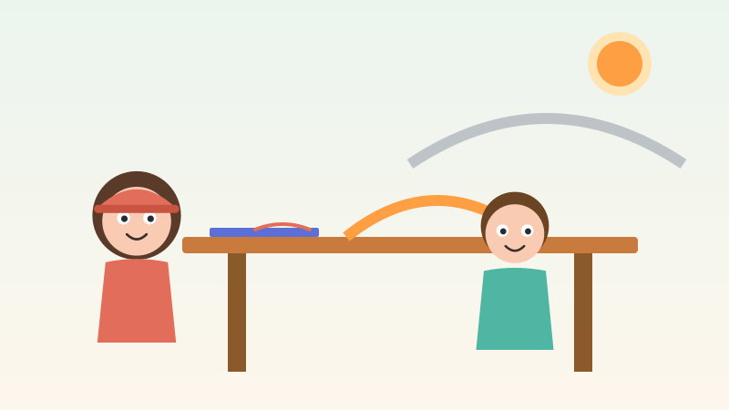

<!-- © 2026 SaberParaTodos / WorldExams. Todos los derechos reservados. Lectura gratuita, prohibida su reproducción. -->
---
slug: "lucia-puentes"
titulo: "Lucía construye puentes"
edad: "5-6"
idioma: "es-neutro"
eje: "oficios"
habitat: "ingenieria"
valor: "perseverar"
personajes: ["lucia", "nico", "maestra"]
paginas: 8
license: "PROPRIETARY-FREE-READ"
version: 1
---

## Pagina 1

Había una vez dos pueblos vecinos separados por un río ancho y ruidoso. La gente del pueblo del sol no conocía a la gente del pueblo de la luna. Para hablar o saludarse, tenían que gritar desde la orilla. Ninguno podía cruzar porque el agua corría muy rápido.

## Pagina 2

De pequeña, a Lucía le gustaba armar puentes con palitos y lana. Cada vez que ponía un juguete encima, los palitos se doblaban y ¡pum!, el puente caía al suelo. Pero Lucía no se ponía triste. Ella sonreía, tomaba su cuaderno y decía: cada puente caído enseña algo nuevo.

## Pagina 3

En la escuela, su maestra le mostró cómo los puentes fuertes se sostienen. Le enseñó a dibujar una curva especial llamada arco. La maestra explicó que la curva del arco no guarda toda la carga en el centro, sino que reparte el peso hacia los lados, enviando la fuerza directo al suelo firme.

## Pagina 4

Lucía construyó una maqueta curva usando cartón, regla y cuerda para medir. Colocó una piedra pequeña encima y el arco resistió. Puso otra y otra más. Con paciencia sumó diez piedras sobre la estructura. Su hermano Nico aplaudió al ver que el puente de prueba aguanta todo ese peso sin doblarse.

## Pagina 5

Al crecer, Lucía se convirtió en ingeniera civil. Tomó su casco terracota, desplegó grandes planos de papel y midió el terreno con pasos y cintas largas. Junto a su equipo de constructoras y obreros, comenzó la obra del gran puente de piedra con un arco fuerte sobre el río.

## Pagina 6

El día de la gran apertura llegó con música y cintas de colores. Su hermano Nico caminó despacio sobre el puente para ser el primero en cruzar. El arco firme no se movió ni un poquito. Desde ambas orillas, las familias aplaudieron con alegría al ver la obra terminada.

## Pagina 7

Gracias al nuevo puente, los habitantes de ambos pueblos se encontraron en el centro. Organizaron un gran mercado donde compartían frutas, pan fresco, cuentos y sonrisas. La gente de la montaña y del valle por fin se abrazó como amigos que celebran juntos todos los días.

## Pagina 8

Lucía miraba el mercado feliz mientras le enseñaba a otros niños a medir con cuerda y regla. Les contaba con orgullo que cada puente caído enseña a hacer el que aguanta. Porque cuando estudiamos y corregimos los errores con perseverancia, logramos construir caminos que unen a las personas.

## Quiz
### Pregunta 1
¿Por qué se caían los puentes de palitos que hacía Lucía de niña?
- [x] A) Porque los palitos no repartían el peso y les faltaba un arco
  <!-- feedback: ¡Correcto! Sin la forma de arco, todo el peso quedaba en el centro y se caían. -->
- [ ] B) Porque los palitos eran de color rojo
  <!-- feedback: El color no influye en la fuerza de la estructura. -->
- [ ] C) Porque el agua del río mojaba los palitos
  <!-- feedback: Lucía probaba sus maquetas en el suelo de su casa. -->

### Pregunta 2
¿Qué forma especial reparte el peso hacia los lados de la estructura?
- [x] A) El arco
  <!-- feedback: ¡Muy bien! La curva del arco distribuye la fuerza hacia los apoyos laterales. -->
- [ ] B) Un triángulo invertido
  <!-- feedback: El triángulo ayuda, pero la curva que reparte el peso hacia los lados es el arco. -->
- [ ] C) Una línea recta muy delgada
  <!-- feedback: Una línea recta sin apoyos se dobla fácilmente con el peso. -->

### Pregunta 3
¿Qué unió el gran puente además de las dos orillas del río?
- [x] A) A los dos pueblos que hicieron un mercado juntos
  <!-- feedback: ¡Excelente! El puente permitió que las familias se visitaran y compartieran en el mercado. -->
- [ ] B) Dos barcos grandes
  <!-- feedback: Los barcos navegan por el agua, el puente unió a las personas de los dos pueblos. -->
- [ ] C) Un bosque con una montaña lejana
  <!-- feedback: El puente unió al pueblo del sol con el pueblo de la luna a través del río. -->

### Explicacion
Lucía aprendió que equivocarse no es caerse, sino descubrir cómo mejorar. Gracias a su estudio sobre los arcos y las medidas, logró construir un puente firme que reunió a dos pueblos en un hermoso mercado. Pregunta a tu niño: ¿qué has aprendido tú cuando algo no sale a la primera?
