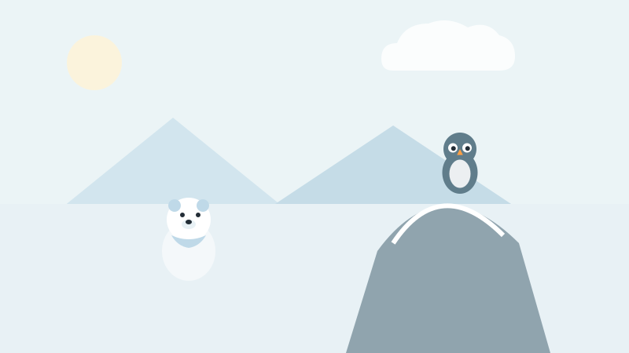
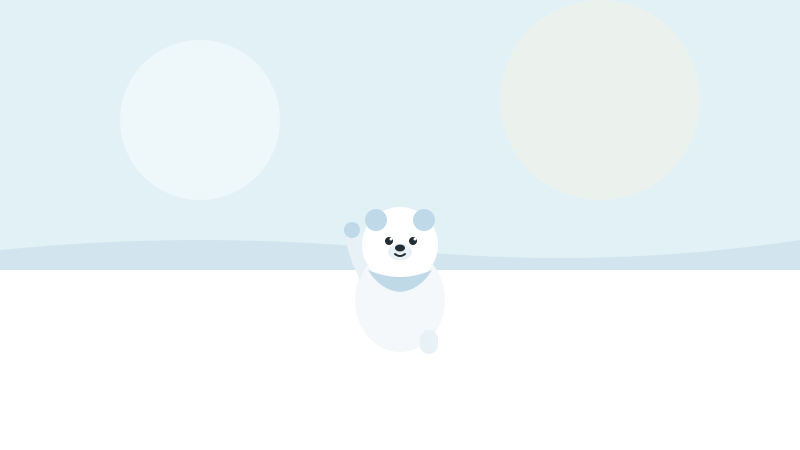
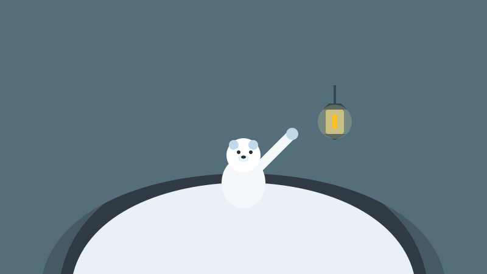
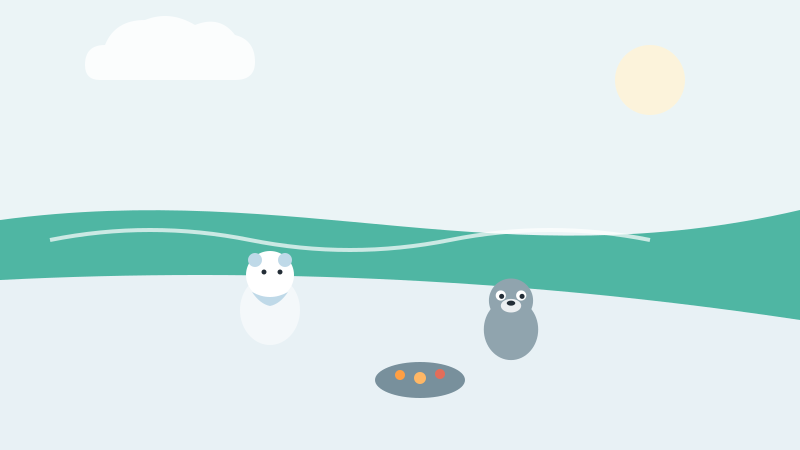
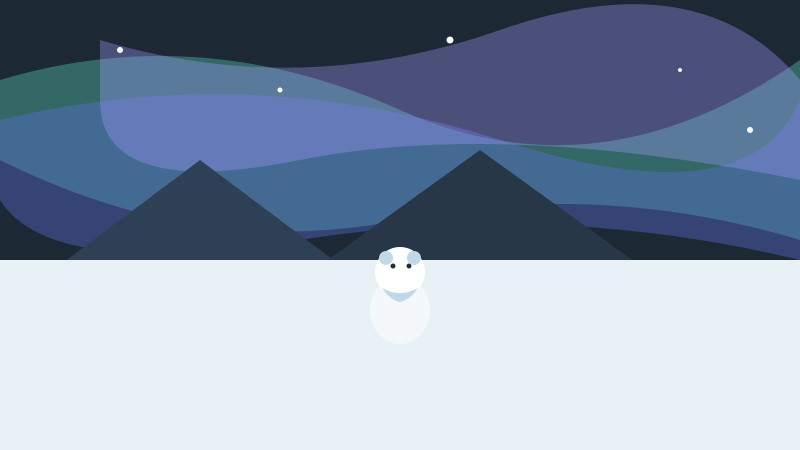
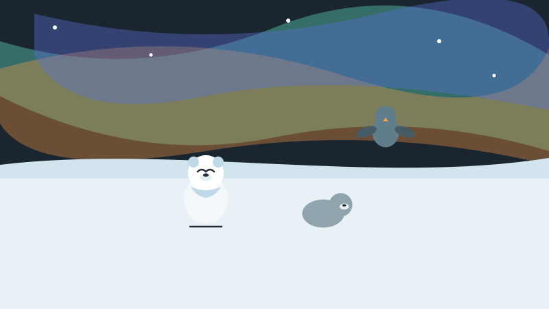

<!-- © 2026 SaberParaTodos / WorldExams. Todos los derechos reservados. Lectura gratuita, prohibida su reproducción. -->
---
slug: "nieve-osa-hielo"
titulo: "Nieve la osa polar y la promesa del hielo"
edad: "4-5"
idioma: "es-neutro"
eje: "animales"
habitat: "tundra"
valor: "responsabilidad"
personajes: ["nieve", "pipo", "glauco"]
paginas: 8
license: "PROPRIETARY-FREE-READ"
version: 1
---

## Pagina 1

En la fría tundra vivía Nieve, una osezna blanca de pelo suave. A Nieve le gustaba patinar sobre el suelo helado y saludar a sus amigos. Pero una tarde de sol, el terreno crujió con fuerza. Un trozo de hielo perdió su grosor y flotó despacio sobre el agua fría.
> Para conversar en familia: Miren cómo patina Nieve sobre el terreno helado y cuenten la historia juntos.
**Palabras nuevas:** tundra, osezna, hielo

## Pagina 2

Desde la cima de una roca blanca voló el búho Glauco, un ave sabia de plumas muy limpias. Glauco acomodó sus alas y le contó a la osezna un gran secreto: cuando desperdiciamos energía y luz en el mundo, el aire se calienta despacio y el suelo helado empieza a derretirse en silencio.
> Para conversar en familia: Pide a tu niña o niño que abra sus brazos imitando el vuelo del búho Glauco.
**Palabras nuevas:** búho, roca, secreto

## Pagina 3

Nieve miró sus patas redondas y sintió ganas de ayudar a su hogar. Levantó la pata derecha con firmeza y prometió cuidar todo lo que tenía a su alrededor. Glauco sonrió con orgullo desde su rama y le dijo que cada pequeña acción cuenta para proteger la tundra y el aire frío.
> Para conversar en familia: Levanten la mano derecha en familia para hacer un compromiso de cuidar el entorno.
**Palabras nuevas:** patas, orgullo, acción

## Pagina 4

Nieve volvió a su cueva de nieve antes de jugar. Apagó la farola de aceite que no usaba y ordenó las ramas secas de la entrada para no malgastar nada. Cuidar la cueva era fácil y entretenido. Con cada pequeño gesto de ahorro, la osezna sentía que cumplía su gran promesa.
> Para conversar en familia: Revisen juntos qué luces de la casa se pueden apagar cuando no las estén usando.
**Palabras nuevas:** cueva, farola, ahorro

## Pagina 5

En la orilla del agua azul, Nieve encontró a su amigo Pipo, una foca gris muy juguetona. Pipo tiraba caracoles al mar sin pensar. Nieve le explicó despacio que cuidar el agua y mantener limpia la orilla ayudaba a que el frío se quedara con ellos. Pipo comprendió y guardó los caracoles en una piedra.
> Para conversar en familia: Señalen los caracoles en la orilla y conversen sobre mantener el agua limpia.
**Palabras nuevas:** foca, caracoles, orilla

## Pagina 6

Llegó la noche y sopló un viento muy fuerte con nieve blanca. Los tres amigos corrieron hacia la cueva segura de Nieve. Se acomodaron juntos en una esquina caliente y compartieron su calor para esperar que pasara el viento. Nadie sintió frío mientras la tormenta soplaba afuera.
> Para conversar en familia: Den un abrazo en familia imaginando que se protegen del viento helado de la nieve.
**Palabras nuevas:** viento, nieve, tormenta

## Pagina 7

Al despertar por la mañana, la tormenta había pasado. En el cielo brillaba una hermosa aurora verde y violeta. Nieve corrió hacia la orilla y vio que el suelo helado estaba firme, grueso y fuerte para patinar. Su esfuerzo y el de sus amigos habían protegido el hábitat durante el invierno.
> Para conversar en familia: Contemplen los colores de la aurora y noten lo firme que quedó el suelo helado.
**Palabras nuevas:** aurora, cielo, invierno

## Pagina 8

Nieve patinó feliz junto a Pipo y Glauco bajo las luces de la aurora. La osezna aprendió una enseñanza valiosa para toda la vida: cada pequeña cosa que cuidas en tu hogar te cuida a ti y a tus amigos. Cuando protegemos la naturaleza con amor, la tierra se mantiene sana y fuerte.
> Para conversar en familia: Conversen sobre una pequeña acción familiar diaria para cuidar la naturaleza de nuestro planeta.
**Palabras nuevas:** enseñanza, naturaleza, amor

## Quiz
### Pregunta 1
¿Qué le pasaba al hielo donde jugaba Nieve?
- [x] A) Se adelgazaba y se derretía
  <!-- feedback: ¡Así es! Por eso Nieve decidió cuidar la energía. -->
- [ ] B) Se volvía de color rojo
  <!-- feedback: No, el hielo seguía blanco pero perdía su grosor. -->
- [ ] C) Se convertía en arena dulce
  <!-- feedback: No, el hielo es agua congelada y se derrite con el calor. -->

### Pregunta 2
¿Qué prometió hacer la osezna Nieve?
- [x] A) Cuidar su hogar y no desperdiciar
  <!-- feedback: ¡Muy bien! Nieve prometió ahorrar energía y cuidar la tundra. -->
- [ ] B) Irse a vivir a otro planeta
  <!-- feedback: No, ella quiso proteger su hogar frío. -->
- [ ] C) Romper todo el hielo con sus patas
  <!-- feedback: Al contrario: quería mantener el suelo helado y firme. -->

### Pregunta 3
¿Qué puedes cuidar tú en casa para ayudar al planeta?
- [x] A) Apagar la luz y cuidar el agua
  <!-- feedback: ¡Excelente! Apagar luces y no desperdiciar agua ayuda mucho. -->
- [ ] B) Dejar las llaves de agua abiertas
  <!-- feedback: Dejar correr el agua desperdicia recursos importantes. -->
- [ ] C) Dejar todas las luces encendidas todo el tiempo
  <!-- feedback: Apagar las luces cuando no las usas ahorra energía. -->

### Explicacion
Nieve aprendió que cuidar nuestro entorno empieza con pequeñas acciones diarias, como apagar las luces o no malgastar el agua. Cuando enseñamos a los niños a ser responsables en casa, ayudamos a conservar la naturaleza y los hábitats de todo el planeta. Pregunta a tu niño: ¿qué farola o luz podemos apagar juntos hoy?
