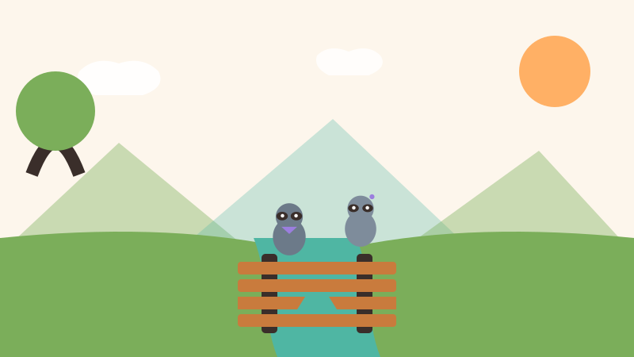
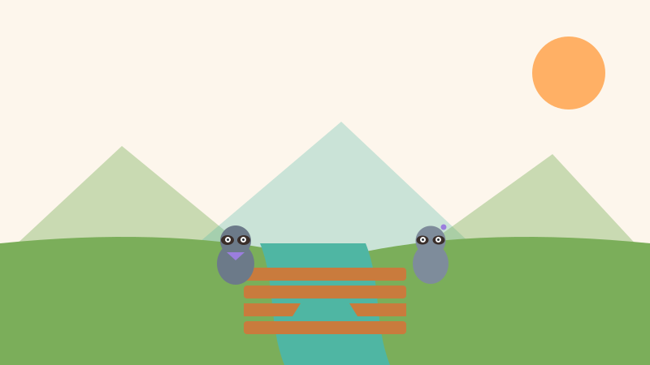
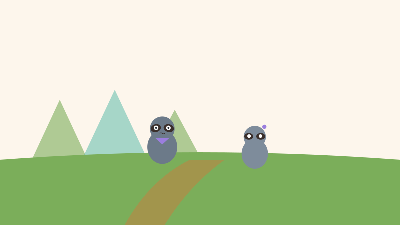
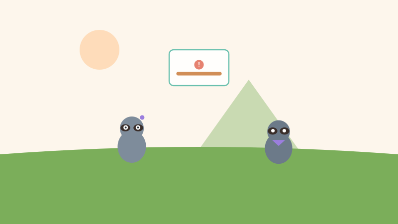
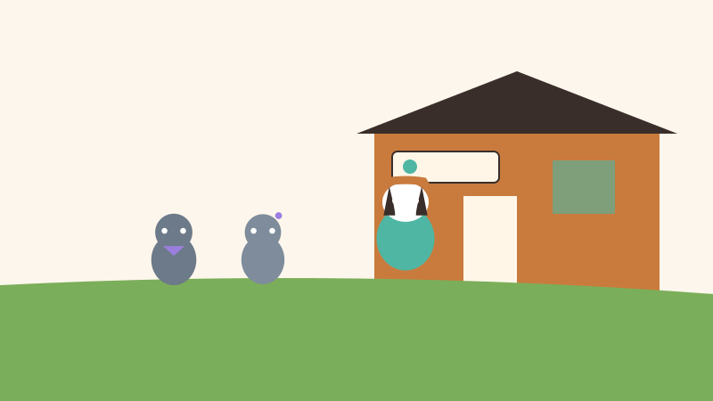
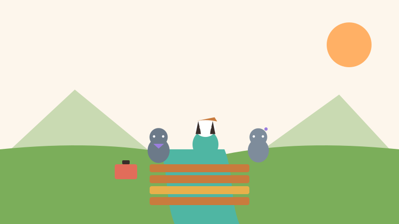
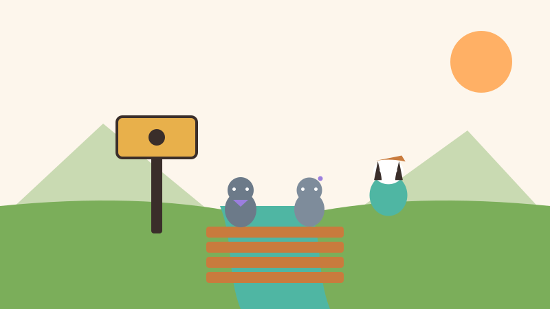
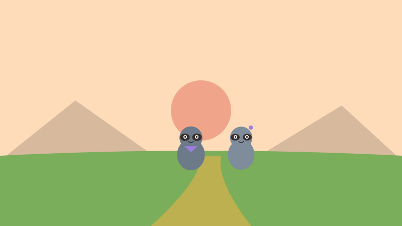

<!-- © 2026 SaberParaTodos / WorldExams. Todos los derechos reservados. Lectura gratuita, prohibida su reproducción. -->
---
slug: "puente-roto-pipo-mia"
titulo: "El puente roto: Pipo y Mía deciden"
edad: "5-6"
idioma: "es-neutro"
eje: "etica"
habitat: "bosque"
valor: "honestidad"
personajes: ["pipo", "mia", "bruno"]
paginas: 8
license: "PROPRIETARY-FREE-READ"
version: 1
---

## Pagina 1

En el bosque de la montaña vivían Pipo y Mía, dos hermanos mapaches muy alegres. Una tarde soleada salieron a jugar cerca del arroyo. Se pusieron a saltar sobre el puente de troncos viejos, contando en voz alta cada salto. De pronto, se oyó un fuerte crujido y una tabla de madera se rompió por la mitad.

## Pagina 2

Los dos mapaches se quedaron inmóviles mirando el hueco en el puente. Pipo y Mía sintieron que su corazón batía muy rápido por la sorpresa. Sabían que habían cometido un error al saltar con tanta fuerza sobre la madera gastada. Tenían dos caminos: correr a esconderse en su cueva o buscar ayuda para resolver el problema antes de que fuera tarde.

## Pagina 3

—¡Vámonos a casa sin decir nada! —susurró Pipo con la voz temblorosa—. Tengo mucho miedo de que nos regañen por haber roto el puente. Si nadie nos vio, nadie sabrá que fuimos nosotros. Pipo miraba hacia los lados con ganas de salir corriendo entre la vegetación alta del camino.

## Pagina 4

Pero Mía negó con la cabeza y miró el agujero en medio del paso.
—No podemos callar, Pipo —dijo Mía con firmeza—. Si alguien camina por aquí de noche, no verá la tabla rota y podría caerse al arroyo. Decir la verdad da miedo, pero dejar el peligro oculto es mucho peor para todos.

## Pagina 5

Juntos caminaron hasta la estación del bosque para buscar a Tejón Bruno, el guardabosques. Con el corazón palpitando, le contaron exactamente lo que había pasado sin inventar excusas. Tejón Bruno los escuchó con atención, cruzó los brazos y les explicó seriamente por qué no se debía saltar con violencia en las maderas del arroyo.

## Pagina 6

Después de las palabras de advertencia, Tejón Bruno sonrió amablemente y sacó su caja de herramientas.
—Gracias por avisar a tiempo —dijo Bruno—. La reprimenda pasa rápido, pero la ayuda se queda. Vamos a reparar la tabla rota entre los tres.
Pipo sostuvo la madera firme mientras Bruno y Mía colocaban clavos fuertes.

## Pagina 7

Cuando el puente quedó más seguro que antes, los tres pintaron un cartel de madera con letras muy claras. Escribieron con cuidado: "Pasar de a uno". Lo clavaron a la entrada del arroyo para que todos los animales del bosque recordaran cuidar el paso. Pipo y Mía sintieron un alivio enorme en el pecho.

## Pagina 8

Al atardecer, los hermanitos caminaron de regreso a casa tranquilos y contentos. Pipo abrazó a Mía y comprendió que enfrentar la verdad siempre es la mejor decisión. Aprendieron que cuando algo se rompe, hablar con honestidad es el primer paso para repararlo. Porque, como dijo Bruno, la verdad arregla más que el silencio.

## Quiz
### Pregunta 1
¿Qué rompieron Pipo y Mía?
- [x] A) Una tabla del puente
  <!-- feedback: ¡Así es! Al saltar rompieron una tabla de madera. -->
- [ ] B) Una ventana de la estación
  <!-- feedback: No, estaban jugando en el arroyo sobre los troncos. -->
- [ ] C) Una caja de herramientas
  <!-- feedback: La caja de herramientas la usó Tejón Bruno para arreglar la tabla. -->

### Pregunta 2
¿Qué quería hacer Pipo y qué dijo Mía?
- [x] A) Pipo quería callar por miedo y Mía dijo que alguien podía caerse
  <!-- feedback: ¡Correcto! Mía pensó en la seguridad de todos los animales. -->
- [ ] B) Pipo quería reparar el puente solo y Mía quería jugar
  <!-- feedback: Pipo tenía miedo a la reprimenda y quería huir sin decir nada. -->
- [ ] C) Los dos querían esconderse en la cueva
  <!-- feedback: Pipo tenía miedo, pero Mía insistió en decir la verdad. -->

### Pregunta 3
¿Qué hicieron después de avisar?
- [x] A) Repararon el puente entre los tres y pusieron un cartel
  <!-- feedback: ¡Muy bien! Trabajaron con Bruno y pusieron el cartel de precaución. -->
- [ ] B) Se fueron a dormir a su cueva
  <!-- feedback: Primero ayudaron a reparar lo que habían roto. -->
- [ ] C) Dejaron que otro animal lo arreglara solo
  <!-- feedback: Ellos asumieron la responsabilidad y ayudaron a arreglarlo. -->

### Explicacion
Pipo sentía miedo de admitir su error, pero Mía recordó que el silencio podía causar un accidente. Al decir la verdad a Tejón Bruno, lograron reparar el puente juntos y cuidar a la comunidad. Pregunta a tu niño: ¿alguna vez te dio miedo decir la verdad y qué pasó después?
