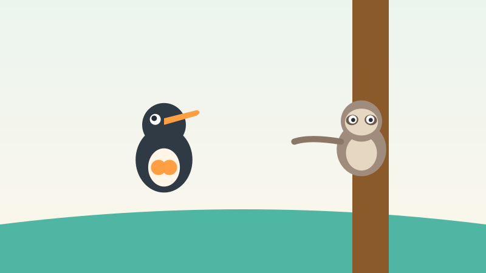
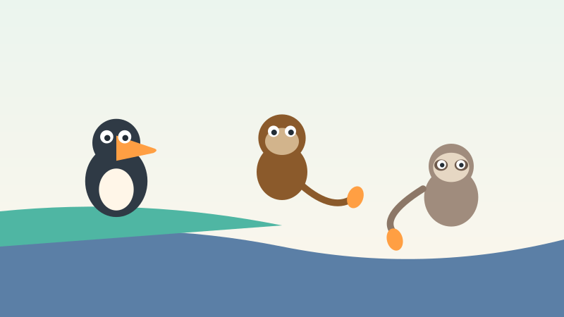
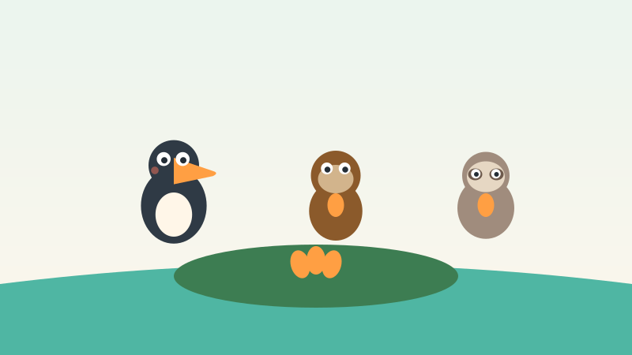
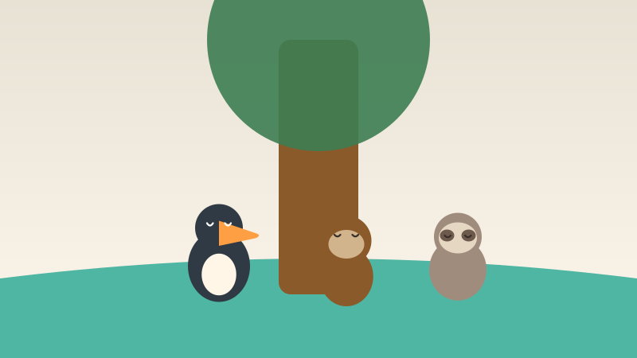

<!-- © 2026 SaberParaTodos / WorldExams. Todos los derechos reservados. Lectura gratuita, prohibida su reproducción. -->
---
slug: "tana-tucan-comparte"
titulo: "Tana la tucán que aprendió a compartir"
edad: "3-4"
idioma: "es-neutro"
eje: "animales"
habitat: "selva"
valor: "compartir"
personajes: ["tana", "tito", "lila"]
paginas: 8
license: "PROPRIETARY-FREE-READ"
version: 1
---

## Pagina 1

En lo alto de la selva vivía Tana, una tucán joven de pico naranja.
Una mañana de sol encontró un árbol lleno de mangos amarillos. Se puso a
contar en voz alta: uno, dos, tres, cuatro, cinco. Nunca había visto
tantos mangos juntos en una sola rama.
> Para conversar en familia: Señala el pico naranja de Tana y cuenta los mangos con tu hija o hijo.
**Palabras nuevas:** selva, tucán, mangos

## Pagina 2

—¡Son todos míos! —dijo Tana muy contenta, y abrazó los mangos con sus
alas abiertas. Los bajó al nido uno por uno, con mucho cuidado. Pesaban
mucho y las alas le temblaban, pero no quería soltar ninguno.
> Para conversar en familia: Muestra cómo Tana abraza sus frutas y conversen sobre guardar o compartir.
**Palabras nuevas:** nido, cuidado, alas

## Pagina 3

Entonces llegó Tito el mono, columpiándose de una rama a otra. Vio los
mangos y se le hizo agua la boca.
—¿Me das uno, Tana? Tengo mucha hambre —pidió con voz dulce.
—No —dijo Tana—. Los encontré yo solita.
> Para conversar en familia: Pide a tu niño que imite la cara que pone Tito cuando siente hambre.
**Palabras nuevas:** mono, rama, hambre

## Pagina 4

Después subió Lila la perezosa, despacio, muy despacio, porque las
perezosas nunca tienen prisa. Miró los mangos con ojos grandes.
—¿Me guardas uno pequeño? —preguntó con voz suave.
—No —dijo Tana—. No van a alcanzar.
> Para conversar en familia: Muevan las manos despacio como avanza la perezosa Lila por los árboles.
**Palabras nuevas:** perezosa, despacio, prisa

## Pagina 5

Los cinco mangos pesaban tanto que las alas de Tana empezaron a temblar
muy fuerte. ¡Plin, plan! Dos mangos se soltaron, rodaron por el pasto y
cayeron al río que corría rápido. Tana lloró con pena: ¡mis mangos!
> Para conversar en familia: Pregunta a tu hija o hijo qué siente Tana cuando ve caer las frutas al agua.
**Palabras nuevas:** pasto, río, pena

## Pagina 6

Tito se lanzó de rama en rama hasta la orilla y atajó un mango con su
cola larga. Lila estiró su brazo lento pero seguro y pescó el otro mango
del agua. Se los llevaron a Tana y dijeron: te ayudamos, para eso están
los amigos de verdad.
> Para conversar en familia: Observen la cola de Tito y conversen sobre lo bueno de ayudar a los demás.
**Palabras nuevas:** orilla, cola, amigos

## Pagina 7

Tana los miró con los ojos llenos de agua y por fin entendió. Repartió
con alegría: un mango para Tito y un mango para Lila. Quedaron tres
mangos, y los comieron juntos bajo el árbol, entre risas y cuentos.
Nunca un mango había sabido tan dulce como ese día.
> Para conversar en familia: Cuenten cuántos mangos quedaron para comer juntos después de repartir.
**Palabras nuevas:** alegría, risas, cuentos

## Pagina 8

Desde ese día, cuando Tana encuentra fruta en la selva, grita fuerte para
que todos la oigan: ¡hay para todos! Y Tito y Lila llegan corriendo. Porque
lo compartido, dice Tana mientras duermen la siesta, sabe mejor.
> Para conversar en familia: Abraza a tu hija o hijo y recuerden algo rico que hayan compartido hoy.
**Palabras nuevas:** fruta, selva, siesta

## Quiz
### Pregunta 1
¿Cuántos mangos encontró Tana?
- [x] A) Cinco
  <!-- feedback: ¡Sí! Uno, dos, tres, cuatro y cinco. -->
- [ ] B) Tres
  <!-- feedback: Tres quedaron al final, pero al inicio eran cinco. -->
- [ ] C) Dos
  <!-- feedback: Dos se cayeron al río, pero había más. -->

### Pregunta 2
¿Quién ayudó a Tana a recuperar los mangos?
- [x] A) Tito y Lila juntos
  <!-- feedback: ¡Exacto! El mono atajó uno y la perezosa pescó el otro. -->
- [ ] B) Solo Tito
  <!-- feedback: Tito ayudó, pero Lila también pescó uno. -->
- [ ] C) Nadie, los perdió
  <!-- feedback: Casi, pero sus amigos llegaron a tiempo. -->

### Pregunta 3
¿Qué aprendió Tana?
- [x] A) Que lo compartido sabe mejor
  <!-- feedback: ¡Muy bien! Esa es la moraleja del cuento. -->
- [ ] B) Que hay que esconder la fruta
  <!-- feedback: Eso intentó al inicio y le salió mal. -->
- [ ] C) Que los amigos estorban
  <!-- feedback: Al contrario: sin ellos pierde los mangos. -->

### Explicacion
Tana quería todo para ella y casi lo pierde todo. Cuando compartió,
ganó algo mejor que los mangos: la alegría de comer con amigos.
Pregunta a tu niño: ¿qué te gusta compartir tú?
