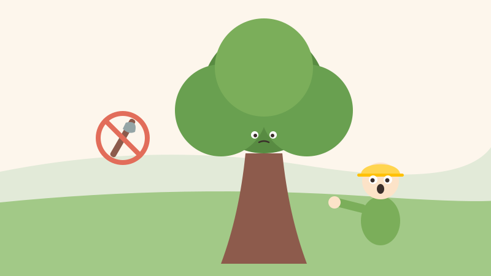
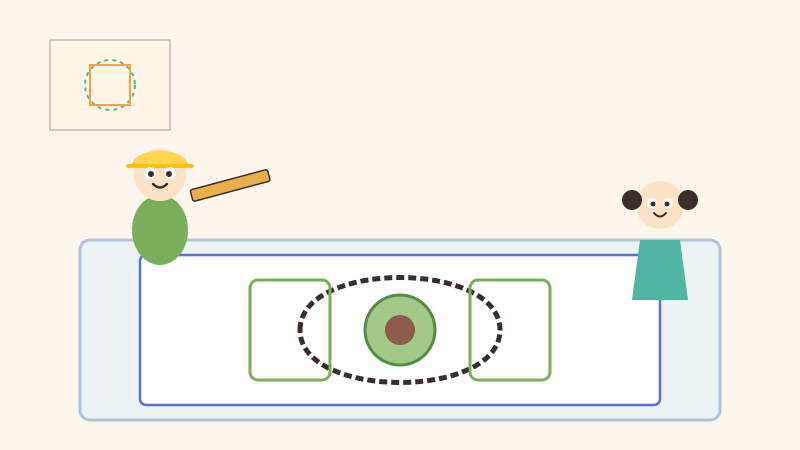
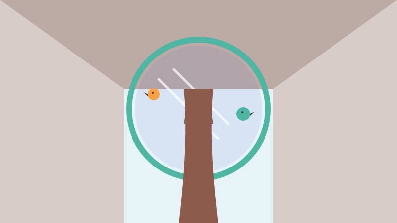
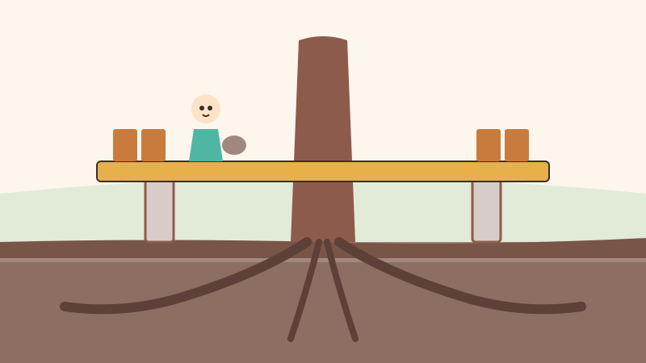
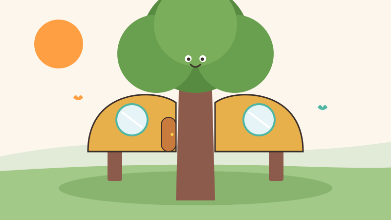
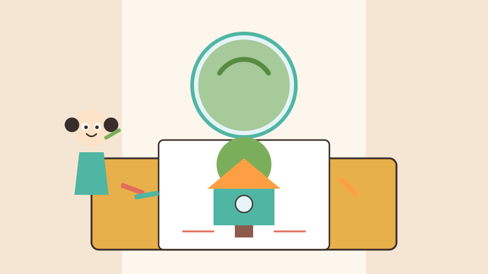
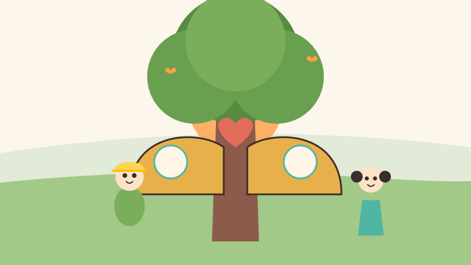

<!-- © 2026 SaberParaTodos / WorldExams. Todos los derechos reservados. Lectura gratuita, prohibida su reproducción. -->
---
slug: "tomas-casa-arbol"
titulo: "Tomás y la casa que abraza el árbol"
edad: "4-6"
idioma: "es-neutro"
eje: "oficios"
habitat: "arquitectura"
valor: "respeto"
personajes: ["tomas", "alba", "ceiba"]
paginas: 8
license: "PROPRIETARY-FREE-READ"
version: 1
---

## Pagina 1

Tomás era un arquitecto a quien le gustaba imaginar lugares amables. Un día
le encargaron diseñar una casa en un terreno verde. Cuando llegó, encontró
al Abuelo Ceiba, un árbol gigante de tronco grueso y hojas frondosas. Tomás
sonrió y contempló su inmensa sombra con gran admiración.
> Para conversar en familia: Abran los brazos imitando el tronco gigante del árbol y sientan su sombra.
**Palabras nuevas:** arquitecto, terreno, sombra

## Pagina 2

Varias personas miraron el terreno y dijeron que debían cortar el árbol para
poner los muros rectos. Pero Tomás movió la cabeza con firmeza y dijo que no.
Él sabía que el Abuelo Ceiba llevaba muchos años allí y que construir nunca
debe significar destruir la naturaleza.
> Para conversar en familia: Muevan la cabeza diciendo que no con firmeza para proteger los árboles del parque.
**Palabras nuevas:** muros, firmeza, naturaleza

## Pagina 3

Tomás sacó su papel azul y trazó un plano especial con formas redondas.
Diseñó la estructura alrededor del tronco principal. La pequeña Alba miraba
asombrada cómo las líneas rectas de las paredes dibujaban una curva suave
para proteger cada rama del anciano árbol.
> Para conversar en familia: Dibujen un círculo en el papel con el dedo imaginando el contorno del árbol.
**Palabras nuevas:** papel, plano, rama

## Pagina 4

En el techo de madera, Tomás dejó un gran hueco circular para que el árbol
pudiera seguir creciendo alto. Además, colocó una hermosa ventana transparente
de vidrio. Así, la luz del sol entraría a la casa y desde adentro se podrían
mirar las estrellas por la noche.
> Para conversar en familia: Miren hacia arriba imaginando ver las estrellas a través de una ventana transparente.
**Palabras nuevas:** techo, ventana, vidrio

## Pagina 5

Para la construcción utilizaron madera firme, barro suave y vidrio brillante.
Tomás supervisó cada paso para que nadie tocara ni lastimara las profundas
raíces bajo el suelo. Colocaron la base sobre soportes elevados para que la
tierra siguiera respirando con total libertad.
> Para conversar en familia: Tocando suavemente el piso, imaginen la tierra suave y sus raíces profundas.
**Palabras nuevas:** barro, raíces, libertad

## Pagina 6

Cuando terminaron la obra, la casa parecía un cálido abrazo alrededor del
tronco. El Abuelo Ceiba regalaba su fresca sombra sobre el techo y las paredes.
El aire adentro se sentía limpio, dulce y lleno de vida. Todos los vecinos
celebraron la alegre noticia.
> Para conversar en familia: Dense un cálido abrazo en familia imitando cómo la casa rodea al viejo árbol.
**Palabras nuevas:** abrazo, paredes, noticia

## Pagina 7

Alba tomó sus lápices de colores y su cuaderno de dibujo. Inspirada por el
trabajo del arquitecto, dibujó su primera casa-árbol con ventanas redondas
y flores en la base. Tomás la felicitó con entusiasmo por aprender a diseñar
con tanto amor y cuidado.
> Para conversar en familia: Anima a tu hija o hijo a dibujar su propia casa de sueños respetando las plantas.
**Palabras nuevas:** lápices, dibujo, entusiasmo

## Pagina 8

Al atardecer, contemplaron juntos la hermosa edificación rodeada de pájaros.
Tomás le recordó a la niña la regla de oro de su oficio: crear no es quitar,
es abrazar. Cuando respetamos la tierra, nuestras casas se vuelven hogares
llenos de paz y armonía.
> Para conversar en familia: Conversen sobre cómo podemos cuidar los árboles y plantas que viven cerca de casa.
**Palabras nuevas:** regla, hogares, armonía

## Quiz
### Pregunta 1
¿Qué querían hacer las personas con el árbol gigante al inicio?
- [x] A) Cortarlo para hacer la casa recta
  <!-- feedback: ¡Sí! Pensaban que estorbaba, pero Tomás les demostró lo contrario. -->
- [ ] B) Regarlo con agua todos los días
  <!-- feedback: Regarlo es bueno, pero ellos querían quitarlo del terreno. -->
- [ ] C) Pintarlo de color azul brillante
  <!-- feedback: No querían pintarlo, querían cortarlo para poner muros. -->

### Pregunta 2
¿Qué inventó el arquitecto Tomás para proteger el árbol?
- [x] A) Dibujó la casa alrededor, con hueco y ventana al cielo
  <!-- feedback: ¡Exacto! Diseñó paredes curvas y un techo con tragaluz. -->
- [ ] B) Construyó una pared alta para esconderlo
  <!-- feedback: No lo escondió, lo integró dentro de la casa. -->
- [ ] C) Mudó el árbol a otra ciudad lejana
  <!-- feedback: El árbol se quedó en su lugar de siempre sin sufrir daño. -->

### Pregunta 3
¿Qué dibujó la niña Alba en su cuaderno al final?
- [x] A) Su primera casa-árbol de colores
  <!-- feedback: ¡Muy bien! Aprendió que crear es proteger la naturaleza. -->
- [ ] B) Un barco para navegar en el río
  <!-- feedback: Dibujó una casa-árbol inspirada en la obra de Tomás. -->
- [ ] C) Un castillo hecho solo de piedra
  <!-- feedback: Casi, pero dibujó su propia versión de una casa-árbol. -->

### Explicacion
Tomás demostró que con imaginación podemos construir sin destruir la naturaleza.
Al diseñar alrededor del árbol, la casa quedó protegida y fresca.
Pregunta a tu niño: ¿cómo te gustaría abrazar a los árboles de tu parque?
