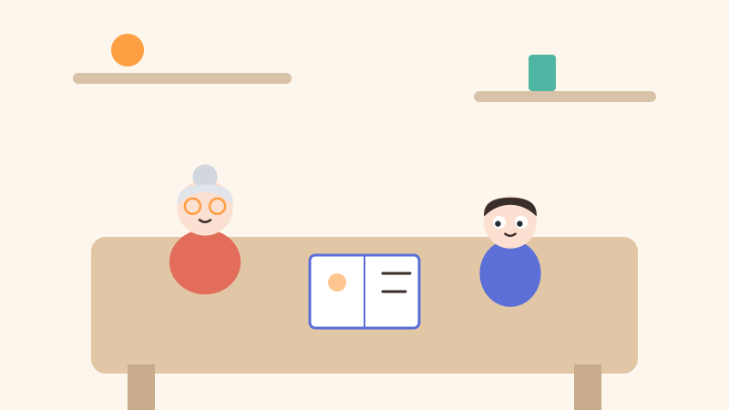
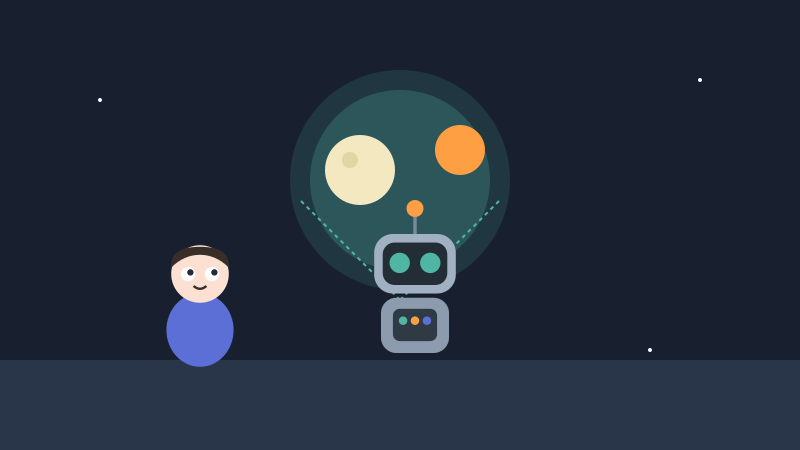
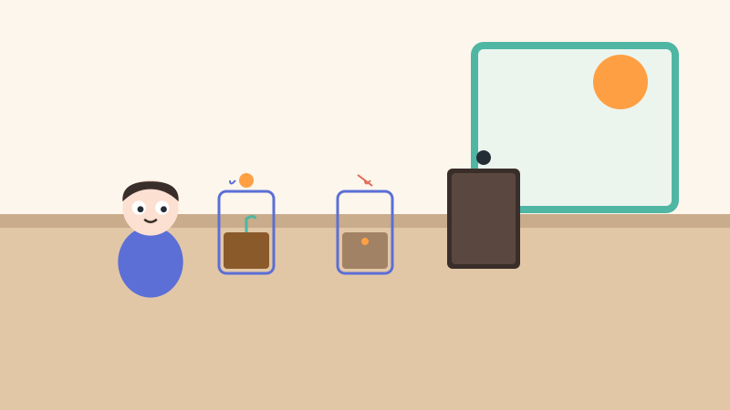
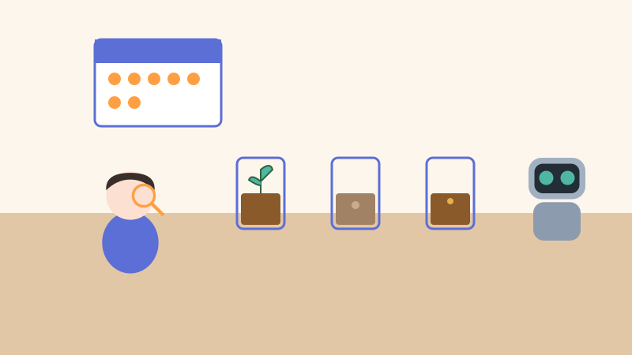
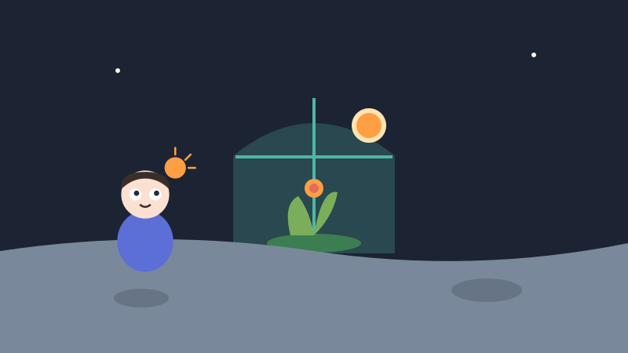
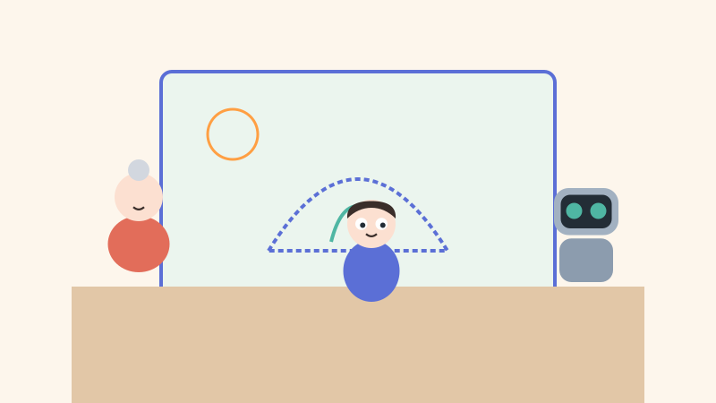
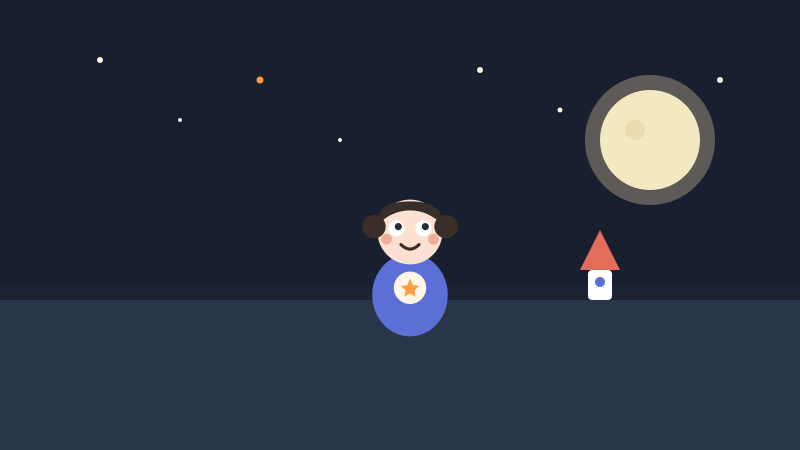

<!-- © 2026 SaberParaTodos / WorldExams. Todos los derechos reservados. Lectura gratuita, prohibida su reproducción. -->
---
slug: "vela-semilla-luna"
titulo: "Vela la niña astronauta y la semilla de la Luna"
edad: "4-6"
idioma: "es-neutro"
eje: "espacio"
habitat: "sistema-solar"
valor: "curiosidad"
personajes: ["vela", "tuerca", "abuela"]
paginas: 8
license: "PROPRIETARY-FREE-READ"
version: 1
---

## Pagina 1

Vela era una niña de seis años que soñaba con ser astronauta. Cada noche miraba la Luna brillante desde la ventana de su habitación. Un día sostuvo una semilla redonda en la palma de su mano y dijo con alegría: quiero sembrar una planta en la Luna.
> Para conversar en familia: Miren la Luna por la ventana e imaginen viajar en un cohete de exploración.
**Palabras nuevas:** astronauta, semilla, planta

## Pagina 2

Su abuela la escuchó con una sonrisa tibia y la invitó a sentarse juntas. Para sembrar en cualquier lugar del espacio, primero debemos investigar, dijo la abuela. Vela tomó su cuaderno y preguntó con mucha curiosidad: ¿qué necesita una semilla para crecer fuerte y sana?
> Para conversar en familia: Pregunta a tu niña o niño qué cree que necesita una pequeña semilla para germinar.
**Palabras nuevas:** abuela, espacio, curiosidad

## Pagina 3

El robot Tuerca encendió sus luces azules para mostrar los datos de la Luna. En la Luna no hay aire para respirar ni agua en el suelo, explicó Tuerca con su voz metálica. Además, el Sol da luz de día, pero la noche es larga y fría.
> Para conversar en familia: Imita la voz divertida del robot Tuerca contando datos interesantes sobre el espacio.
**Palabras nuevas:** robot, aire, datos

## Pagina 4

Vela decidió hacer un experimento en la mesa de la cocina. Preparó tres vasos transparentes con tierra y una semilla en cada uno. El primer vaso recibió agua y luz de sol. El segundo no recibió agua. El tercer vaso quedó a oscuras dentro de una caja.
> Para conversar en familia: Cuenten los tres vasos del experimento y recuerden la importancia de la luz y el agua.
**Palabras nuevas:** experimento, mesa, cocina

## Pagina 5

Durante siete días, Vela y Tuerca observaron los vasos cada mañana. Anotaron todos los cambios en el cuaderno de astronauta. La semilla del primer vaso brotó con hojas verdes. En cambio, las semillas sin agua o sin luz no pudieron crecer.
> Para conversar en familia: Cuenten juntos siete días de la semana imaginando ver brotar pequeñas hojas verdes.
**Palabras nuevas:** mañana, cambios, hojas

## Pagina 6

¡Ya comprendo!, exclamó Vela con emoción. Las plantas necesitan luz y agua para vivir. Como la Luna no tiene aire ni agua fácil, necesitamos llevar agua y construir una casita de cristal. ¡Un invernadero que guarde el aire y el calor del Sol!
> Para conversar en familia: Dibujen con las manos la forma de una casita de cristal transparente para proteger las plantas.
**Palabras nuevas:** emoción, casita, cristal

## Pagina 7

Vela, la abuela y Tuerca dibujaron juntos la base lunar del futuro. En el dibujo pintaron un domo transparente lleno de flores y brotes verdes. Tuerca sonrió con sus luces y la abuela guardó el plano en el cofre de las grandes ideas.
> Para conversar en familia: Imaginen qué tipo de flor o hortaliza sembrarían ustedes en una base lunar familiar.
**Palabras nuevas:** domo, flores, cofre

## Pagina 8

Esa noche, Vela miró de nuevo la Luna desde su ventana. Ahora sabía que para ser astronauta no solo se necesita un cohete espacial. Preguntar, observar y probar con paciencia es la forma en que los grandes exploradores viajan por las estrellas.
> Para conversar en familia: Contemplen las estrellas de la noche celebrando la alegría de preguntar y aprender en familia.
**Palabras nuevas:** cohete, exploradores, estrellas

## Quiz
### Pregunta 1
¿Qué necesita una semilla para crecer?
- [x] A) Luz del Sol y agua
  <!-- feedback: ¡Correcto! La luz y el agua son indispensables para que la semilla germine y crezca. -->
- [ ] B) Solamente aire frío
  <!-- feedback: No, el aire frío sin agua ni luz no permite crecer a las plantas. -->
- [ ] C) Solo una caja oscura
  <!-- feedback: En el experimento de Vela, la semilla en la caja oscura no pudo crecer. -->

### Pregunta 2
¿Qué pasó en el experimento de los tres vasos?
- [x] A) Solo creció la semilla que tenía luz y agua
  <!-- feedback: ¡Así es! Las otras semillas no pudieron crecer sin agua o sin luz. -->
- [ ] B) Crecieron los tres vasos por igual
  <!-- feedback: Recuerda que las semillas sin agua o sin luz no se desarrollaron. -->
- [ ] C) Ninguna semilla logró salir de la tierra
  <!-- feedback: El primer vaso sí dio un hermoso brote verde. -->

### Pregunta 3
¿Qué inventó Vela para poder cultivar en la Luna?
- [x] A) Una casita de cristal o invernadero
  <!-- feedback: ¡Excelente! Un invernadero protege del frío y guarda la luz y el aire. -->
- [ ] B) Un cohete lleno de sombra
  <!-- feedback: Las plantas necesitan luz, no solo sombra. -->
- [ ] C) Un gran balde de arena
  <!-- feedback: La arena no sustituye el aire ni la humedad que necesitan las semillas. -->

### Explicacion
Vela aprendió que las plantas necesitan luz y agua para vivir, elementos que en la Luna son muy difíciles de conseguir de forma natural. Por eso, al experimentar y observar, comprendió que un invernadero o casita de cristal protegería la vida en el espacio. Preguntar y probar es el camino de todo gran explorador.
