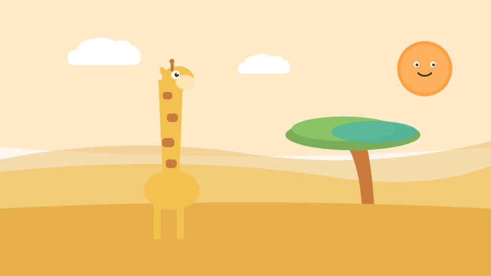
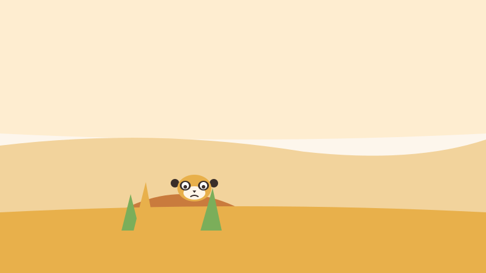
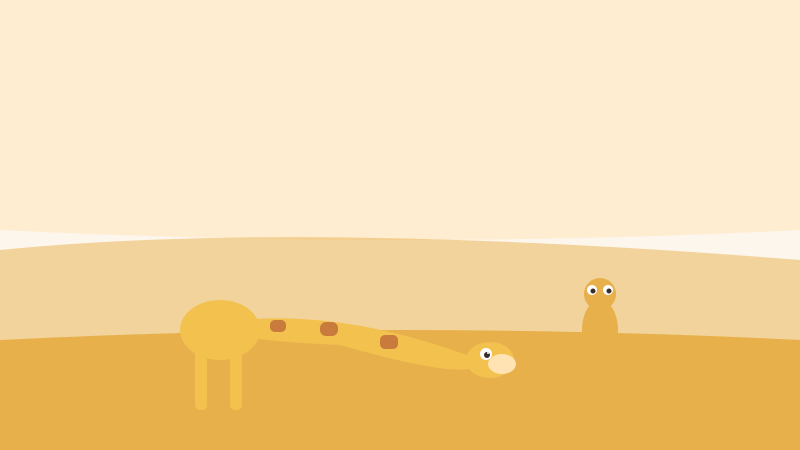
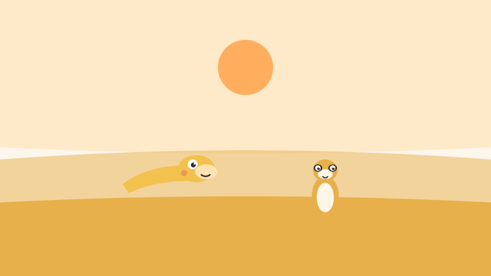
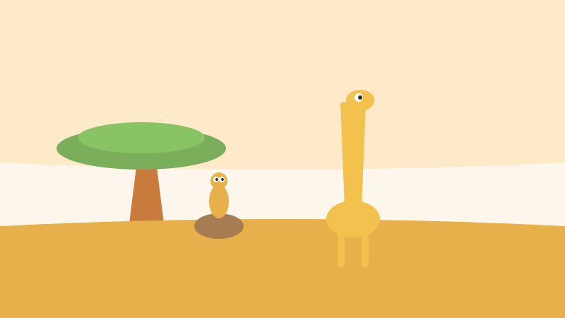
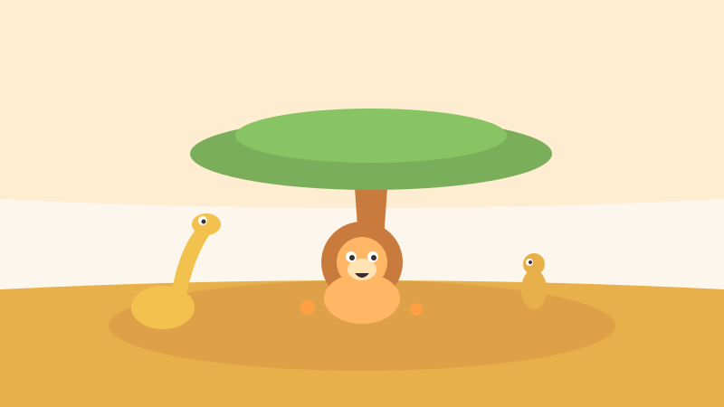
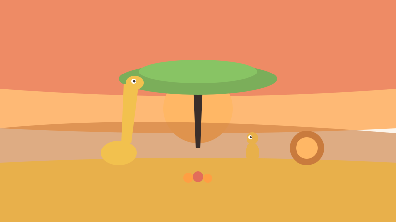
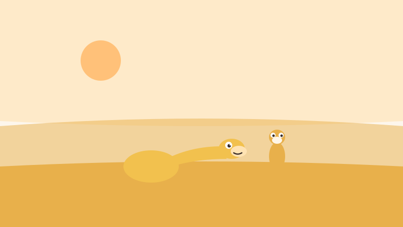

<!-- © 2026 SaberParaTodos / WorldExams. Todos los derechos reservados. Lectura gratuita, prohibida su reproducción. -->
---
slug: "zara-jirafa-mira"
titulo: "Zara la jirafa que miraba lejos"
edad: "3-4"
idioma: "es-neutro"
eje: "animales"
habitat: "sabana"
valor: "empatia"
personajes: ["zara", "mote", "rugido"]
paginas: 8
license: "PROPRIETARY-FREE-READ"
version: 1
---

## Pagina 1

En la sabana dorada vivía Zara, una jirafa joven de cuello
muy largo. A Zara le gustaba mirar el cielo y contar las
nubes esponjosas. Desde arriba veía todo grande y lejano. Cuando
caminaba rápido entre los pastos, reía sin notar a los animales
pequeños que pasaban abajo.

## Pagina 2

Un día, Mote el suricata corría a buscar semillas cuando las
enormes patas de Zara pasaron muy cerca. El viento despeinó a
Mote y lo asustó mucho. Se escondió triste detrás de una
piedra alta y pensó que a Zara no le importaban los
pequeños de la sabana.

## Pagina 3

Zara escuchó un suspiro bajito y se detuvo a buscar con
la mirada. Para ver bien, bajó su cuello poco a poco
hasta tocar casi el pasto. Sus ojos amarillos vieron por
primera vez el mundo chiquito de Mote: hormigas trabajadoras, flores
ocultas y pequeñas piedras brillando al sol.

## Pagina 4

—¡Hola, Mote! —dijo Zara con voz suave—. Perdóname por asustarte,
no me di cuenta desde tan alto.
Mote la miró a los ojos y sonrió alegre. Zara entendió
que para ser una buena amiga no basta con mirar lejos,
también hay que agacharse y mirar de cerca.

## Pagina 5

Desde esa tarde formaron un equipo fabuloso para cuidar a
todos. Zara miraba desde lo alto si venía alguna lluvia
fuerte. Mote avisaba desde el suelo si había piedras o
raíces en el camino. Los dos se cuidaban por turnos
con mucho cariño y respeto.

## Pagina 6

Al mediodía visitaron a Rugido, un león viejito y muy
bueno que ya no tenía dientes y comía fruta dulce
que caía de las acacias. Rugido se echó en la
sombra y les contó hermosas historias de la sabana mientras
descansaban juntos.

## Pagina 7

Al atardecer organizaron una gran fiesta bajo la gran acacia.
Los animales grandes y pequeños cantaron felices en círculo.
Zara compartía frutas del árbol alto y Mote repartía semillas
del suelo. Todos celebraban que la amistad une a grandes
y chiquitos por igual.

## Pagina 8

Ahora Zara sabe que el mundo es más lindo cuando se
mira con atención. Siempre que quiere platicar con un amigo
pequeño, dobla su largo cuello con ternura. Porque para
entender de verdad a los demás, a veces hay que
agacharse un poquito.

## Quiz
### Pregunta 1
¿Por qué se escondió Mote el suricata?
- [x] A) Porque la estatura de Zara lo asustó sin querer
  <!-- feedback: ¡Así es! Zara caminaba alto y no vio al pequeño Mote. -->
- [ ] B) Porque quería jugar a las escondidas
  <!-- feedback: No jugaban, Mote se asustó cuando las patas pasaron cerca. -->
- [ ] C) Porque tenía sueño y fue a dormir
  <!-- feedback: Mote estaba buscando semillas, no durmiendo. -->

### Pregunta 2
¿Qué hizo Zara para entender a Mote?
- [x] A) Bajó el cuello y miró su mundo de cerca
  <!-- feedback: ¡Correcto! Se agachó para estar a la misma altura de su amigo. -->
- [ ] B) Se fue corriendo a otra parte
  <!-- feedback: No, Zara se detuvo a buscar de dónde venía el suspiro. -->
- [ ] C) Subió a un árbol más alto
  <!-- feedback: Al contrario, bajó su cuello hacia el suelo. -->

### Pregunta 3
¿Cómo ayudan Zara y Mote juntos?
- [x] A) Vigilan la sabana por turnos desde lo alto y lo bajo
  <!-- feedback: ¡Excelente! Cada uno usa su talento para cuidar al otro. -->
- [ ] B) Esconden las frutas del león Rugido
  <!-- feedback: No, Rugido es un león bueno que come fruta y comparte. -->
- [ ] C) Compiten para ver quién corre más rápido
  <!-- feedback: No compiten, trabajan juntos como un gran equipo. -->

### Explicacion
Zara aprendió a ponerse en el lugar de Mote bajando a su altura para comprenderlo.
La empatía nos enseña a escuchar y mirar el mundo como lo ven los demás.
Pregunta a tu niño: ¿qué haces tú para escuchar con cariño a tus amigos?
